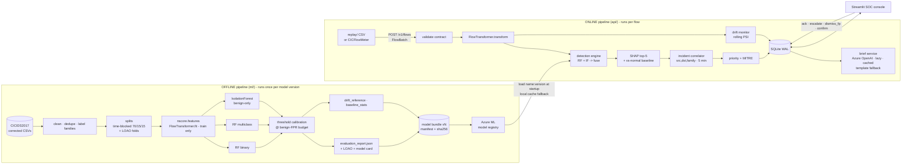

# 03 — NetSentinel Final Architecture

> **One line:** NetSentinel puts two detectors side by side. A Random Forest recognises known attack families. An Isolation Forest trained only on benign traffic flags anything that doesn't look normal. Their output is grouped into explained, prioritised **incidents** for a SOC analyst. Nothing is ever auto-blocked.

## 1. System overview



**Design principles**
1. **Separate offline and online pipelines** (kept from Doc B). Serving never imports training-only dependencies.
2. **One shared core (`nscore/`)** for anything that must behave the same in training and serving: feature transform, fusion, drift math, bundle loading. This prevents train/serve skew by construction.
3. **Contract first.** `nscore/contracts/schemas.py` plus JSON fixtures are the only coupling between components, so five people can build in parallel.
4. **Honest by default.** Thresholds come from an FPR budget, every claim has a matching metric, and the limitations are written down.
5. **Demo-proof.** Every external dependency (Azure ML, Azure OpenAI, Wi-Fi) has a local fallback.

## 2. Repository layout

```
netsentinel/
├─ nscore/                 shared core library (pip install -e .)
│  ├─ contracts/           schemas.py · policy.py · feature_spec.json · fixtures/   ← the contract
│  ├─ features/            FlowTransformer (M1)
│  ├─ detection/           fusion.py (M2)
│  ├─ drift/               PSI + reference builder (M1)
│  └─ bundle/              manifest, packager, loader w/ Azure ML + cache (M2)
├─ ml/                     offline pipeline: data/ train/ evaluate/ explain/ registry/   (M1, M2)
├─ api/                    FastAPI service: app/ (routers, services, repo) tests/         (M3, M5 brief)
├─ dashboard/              Streamlit SOC console: app.py, pages/                          (M4)
├─ replay/                 replay engine + scenarios/*.yaml + lab capture notes           (M5)
├─ infra/                  docker-compose, Azure provisioning scripts                     (M3)
├─ notebooks/              EDA + experiments (never imported by code)
├─ data/                   gitignored: raw/ interim/ processed/ splits/
├─ artifacts/              gitignored: bundles, cache
├─ tests/                  cross-cutting tests (contracts, train/serve parity)
└─ docs/                   this folder + model_card.md + runbooks
```

## 3. Offline pipeline

### 3.1 Data → families
- Source: the corrected CICIDS2017 (fall back to the original and document the label noise).
- Drop from features, keep as metadata: `Flow ID`, `Source IP`, `Destination IP`, `Source Port`, `Timestamp`. `Destination Port` is an open experiment (B12).
- Inf/NaN: count them per column, then drop or clip them, and record the counts in `data_profile.md`. Remove exact duplicates.
- Label mapping → `AttackFamily`: `BENIGN` · `DoS` (Hulk, GoldenEye, slowloris, Slowhttptest) · `DDoS` · `PortScan` · `BruteForce` (FTP-/SSH-Patator) · `WebAttack` (Brute Force, XSS) · `Botnet` · `Rare` (Heartbleed, Infiltration, SQL Injection). "Attempted" labels in the corrected set map to `BENIGN`, as the dataset authors do. Document this.
- Correlation pruning (|ρ| > 0.95, keep the more interpretable feature). The result is written to `nscore/contracts/feature_spec.json`.

### 3.2 Evaluation protocol

| Protocol | How | Answers | Used for |
|---|---|---|---|
| **P1 time-blocked** | For each (day, label) group, sort by timestamp: first 70% → train, next 15% → val, last 15% → test. Indices are saved to `data/splits/` so every run uses the exact same split. | How well do we detect *known* families? | Main per-class metrics, threshold tuning (val), model card |
| **P2 LOAO** | For each family F in {DoS, DDoS, PortScan, BruteForce, WebAttack, Botnet}: remove F completely from train and val, retrain RF and IF on a fixed-size subsample, then measure recall on F's test flows at the calibrated benign FPR. | **Can we catch a family we've never seen?** | The headline chart: RF-only recall vs fusion recall for each held-out family |
| P3 cross-day (optional) | Train on Mon–Wed, test on Thu–Fri, binary only. | How much does performance degrade over time? | Drift discussion |

Metrics reported per class: precision, recall, F1, **FPR**, support, one-vs-rest ROC-AUC. Overall: macro-F1, binary ROC-AUC and PR-AUC, benign FPR at the operating point. Confusion matrix saved as PNG and JSON. Probability calibration checked with a reliability plot.

### 3.3 Models

| Model | Train on | Role | Notes |
|---|---|---|---|
| `rf_binary` | all train flows | p(attack) | `class_weight="balanced_subsample"` by default. SMOTE compared on train only, inside the CV folds. Tune `n_estimators, max_depth, min_samples_leaf` with time-blocked CV. |
| `rf_multiclass` | attack flows only | which family | Only runs when the verdict is `known_attack`. Rare families merged. |
| `iforest` | **benign train flows only** | anomaly score → percentile of benign val scores | `contamination` isn't used for thresholding. We set `tau_anomaly` as a percentile (e.g. 99.5) instead. |

**Thresholds (M2-07):** choose `tau_binary` so that benign FPR ≤ 1.0% on val, and `tau_anomaly` = the 99.5th percentile of benign val anomaly scores (adds ≤ 0.5% FPR). The combined operating FPR is reported. Honest note: 1% of a large network's benign flows is still a lot of flows, which is exactly why the correlator exists (§4.3). Report **incidents per hour of replay** as well as per-flow FPR.

### 3.4 Explainability
- `shap.TreeExplainer` for `rf_binary` (known attacks) **and** for `iforest` (novel anomalies; TreeExplainer supports IsolationForest), so every alert can be explained.
- Each alert gets the top 5 `{feature, raw value, shap_value, benign median}`. The benign median comes from `baseline_stats.json` and lets the UI say "this flow's inter-arrival time is 4,000× shorter than normal".
- Global importance is precomputed for the Model page.
- Latency budget: < 50 ms per flow on a laptop. Cap the tree depth and count if it runs slower.

### 3.5 Model bundle (the offline → online contract)

```
bundle_vN/
  manifest.json            BundleManifest: version, dataset, split, feature_spec sha256, file sha256s, metrics
  feature_spec.json        ordered features, clip/log rules
  transformer.joblib       fitted FlowTransformer
  rf_binary.joblib
  rf_multiclass.joblib
  iforest.joblib
  iforest_benign_val_scores.npy   for score -> percentile
  thresholds.json          {"tau_binary": .., "tau_anomaly": .., "operating_fpr": ..}
  label_map.json           class index -> AttackFamily
  drift_reference.json     quantile bins + proportions, top-15 features + reference attack rate
  baseline_stats.json      benign median / p95 per feature
  evaluation_report.json   EvaluationReport schema
  confusion_matrix.png, loao.png, reliability.png
```

There are two bundles in the registry:
- `netsentinel-bundle:N`, the full model.
- `netsentinel-demo-holdout-botnet:N`, trained **without Botnet**. It powers the "this model has never seen a botnet" demo moment, and having two models in the registry shows why the registry is there.

### 3.6 Registry
Azure ML workspace. `MLClient.models.create_or_update` with tags `{dataset, split, contract_version, macro_f1, benign_fpr, held_out}`. The API resolves `MODEL_REF=azureml:netsentinel-bundle@latest`, downloads it to `artifacts/cache/`, and verifies the sha256s. If Azure is unreachable, it falls back to the cached copy. `local:` refs are supported for development.

## 4. Online pipeline (FastAPI)

### 4.1 Endpoints (`/v1`, all bodies are contract models)

| Method | Path | Body / query | Returns | Notes |
|---|---|---|---|---|
| GET | `/health` | | `{status, model_loaded, model_version}` | liveness + readiness |
| GET | `/v1/model` | | `ModelInfo` | |
| GET | `/v1/model/evaluation` | | `EvaluationReport` | feeds the Model page |
| POST | `/v1/flows` | `FlowBatch` (≤ 500) · header `X-API-Key` | `ScoreBatchResponse` | transform → fuse → SHAP (non-benign only) → correlate → persist |
| GET | `/v1/incidents` | `status, verdict, family, band, since, limit, offset, sort=priority\|last_seen` | `IncidentPage` | |
| GET | `/v1/incidents/{id}` | | `IncidentDetail` | |
| POST | `/v1/incidents/{id}/actions` | `AnalystActionIn` · header `X-Analyst` | `AnalystActionRecord` | updates status, writes audit log |
| GET | `/v1/incidents/{id}/brief` | `refresh=false` | `Brief` | lazy, cached, 8 s timeout → template fallback |
| GET | `/v1/drift` | | `DriftReport` | |
| GET | `/v1/metrics` | | `LiveMetrics` | throughput, p50/p95 latency, confirmed precision, MTTA |
| POST | `/v1/admin/reload-model` | `{model_ref}` · admin key | `ModelInfo` | switches the demo between the full and holdout bundles |

**Mock mode** (`NS_MOCK=1`): every GET serves `nscore/contracts/fixtures/*.json`. This is ready on day 1 so the dashboard isn't waiting on the backend.

### 4.2 Scoring path for one flow
```
FlowRecord → transformer.transform_records → x
p = rf_binary.predict_proba(x)[1]
a = percentile(iforest.score_samples(x), benign_val_scores)
v = fuse(p, a, tau_binary, tau_anomaly)
if v == KNOWN_ATTACK: family, fconf = rf_multiclass.predict
if v == NOVEL_ANOMALY: family = Unknown, conf = novel_confidence(a, tau_anomaly)
if v != BENIGN: top5 = shap(explainer_for(v), x) joined with baseline_stats
incident = correlator.upsert(meta, v, family, conf, top5)
priority = policy.priority_score(family, v, max_conf, incident.flow_count)
drift_monitor.observe(x, v)        # every flow, benign included
```

### 4.3 Incident correlator
- Key: `(src_ip, dst_ip, family)`. Novel anomalies use `(src_ip, dst_ip, "Unknown")`.
- Window: an open incident absorbs a matching flow if `flow.observed_at − incident.last_seen ≤ 5 min` and the incident's status isn't `resolved` or `dismissed_fp`.
- On upsert: `flow_count += 1`, `max_confidence = max(...)`, `last_seen`, a running mean of |SHAP| per feature for the incident's top 5, and a recomputed priority.
- The effect: replaying a 50k-flow DDoS produces about one incident per source/destination pair. Report the flows-to-incidents ratio. It's a strong slide.

### 4.4 Database (SQLite, WAL mode; swap the URL for Azure SQL or Postgres later)

```sql
CREATE TABLE flows (
  flow_id TEXT PRIMARY KEY, observed_at TEXT, received_at TEXT,
  src_ip TEXT, dst_ip TEXT, src_port INT, dst_port INT, protocol INT,
  features_json TEXT, verdict TEXT, p_attack REAL, anomaly_pct REAL,
  attack_family TEXT, incident_id TEXT REFERENCES incidents(incident_id),
  ground_truth TEXT, model_version TEXT, latency_ms REAL
);
CREATE TABLE incidents (
  incident_id TEXT PRIMARY KEY, status TEXT DEFAULT 'new', verdict TEXT, attack_family TEXT,
  mitre_id TEXT, mitre_name TEXT, priority INT, priority_band TEXT, max_confidence REAL,
  flow_count INT, src_ip TEXT, dst_ip TEXT, dst_port INT, first_seen TEXT, last_seen TEXT,
  top_features_json TEXT, brief_json TEXT, model_version TEXT,
  acknowledged_at TEXT, updated_at TEXT
);
CREATE TABLE analyst_actions (
  action_id INTEGER PRIMARY KEY AUTOINCREMENT, incident_id TEXT REFERENCES incidents(incident_id),
  analyst TEXT NOT NULL, action TEXT NOT NULL, note TEXT, at TEXT DEFAULT CURRENT_TIMESTAMP
);
CREATE TABLE drift_snapshots (
  id INTEGER PRIMARY KEY AUTOINCREMENT, computed_at TEXT, window_size INT,
  status TEXT, max_psi REAL, report_json TEXT
);
CREATE INDEX ix_inc_open ON incidents(status, priority DESC);
CREATE INDEX ix_inc_key  ON incidents(src_ip, dst_ip, attack_family, last_seen);
```
Benign flows: keep at most N recent ones (configurable), because drift only needs the rolling window.

### 4.5 Drift monitor
- Rolling window of the last 2,000 transformed flows. Every 500 flows it computes PSI for each of the top-15 features against `drift_reference.json`, plus the predicted attack rate compared with the reference rate.
- Status: max PSI < 0.10 is `ok`, < 0.25 is `watch`, anything higher is `alert`. Each check writes a snapshot. Alert status shows a "consider retraining" banner linked to `docs/runbook_retrain.md`.
- In the demo, the holdout scenario visibly pushes PSI up.

### 4.6 Brief service (Azure OpenAI)
- Input: structured incident JSON only (family, verdict, confidence band, flow count, top features with raw values and benign medians, MITRE ID, IPs and port). No raw payloads.
- System prompt (extends Doc B §6): write 3–4 sentences covering what was seen, why it was flagged (only from the given features), and one suggested next step. Don't invent details. **Hedge to match the confidence band.** For `novel_anomaly`, say plainly that no known family matched.
- Generated when first requested, then cached in `incidents.brief_json`. Times out after 8 s and falls back to a deterministic template brief (`source: "template"`). A failed brief never blocks the queue.
- Config comes only from environment variables: `AZURE_OPENAI_ENDPOINT`, `AZURE_OPENAI_API_KEY`, `AZURE_OPENAI_DEPLOYMENT`, `AZURE_OPENAI_API_VERSION`.

### 4.7 Security and ops of the system itself
- `X-API-Key` on ingest, `X-Analyst` (name + role) on actions, admin key on reload. Secrets live in `.env`, never in git, and CI runs secret scanning.
- Structured JSON logs with a request ID. p50/p95 latency is exposed in `/v1/metrics`.
- Pydantic validation rejects malformed flows with a 422 that names the missing feature.

## 5. SOC console (Streamlit)

| Page | Shows | Key interactions |
|---|---|---|
| **Live Queue** | Incidents sorted by priority. P1–P4 colour bands. Chips for `Known attack` and `Novel anomaly`. Header counters: open P1s, novel anomalies, flows/sec. Auto-refreshes every 3 s and highlights new rows. | filter by status/verdict/family/band, click through to detail |
| **Incident Detail** | SHAP bar chart · **"vs normal"** table (value vs benign median) · MITRE badge · flow metadata · brief panel (loading, LLM or template label) · action timeline | Acknowledge / Escalate / Confirm / Dismiss as FP, with a note |
| **Model & Evaluation** | Model version and registry ref · per-class table · confusion matrix · **LOAO chart** · operating FPR · limitations | — |
| **Drift & Health** | PSI per feature against the 0.10/0.25 lines · status banner · throughput · latency | — |
| **Analyst Metrics** | Analyst-confirmed precision · FP dismiss rate · MTTA · actions per analyst | — |

Analyst sign-in is a name plus a role in session state, sent as `X-Analyst`. React stays a stretch goal and uses the same API.

## 6. Demo storyline (≈ 4 min)
1. **Calm.** Benign replay runs, the queue is empty, drift is `ok`, and the model page shows v N from Azure ML.
2. **Known attack.** A brute-force burst arrives as one P2 incident with 260 flows, mapped to MITRE T1110. Generate the brief, then Escalate.
3. **Alert storm.** The DDoS replay runs: 4,000+ flows become **one** incident. "That's the alert-fatigue answer."
4. **The money shot.** Reload the **holdout bundle** (it has never seen a botnet) and replay botnet traffic. The RF stays quiet and the Isolation Forest fires, so it appears as **Novel anomaly** with a SHAP explanation. Drift moves to `watch`. Show the LOAO chart: "here's that result across every family, measured properly".
5. **Honesty.** Dismiss a low-confidence incident as a false positive and the analyst-confirmed precision updates live. Walk through the limitations slide.
6. Fallback: a recorded video of steps 1–5. Briefs fall back to the template if Azure OpenAI is unreachable.

## 7. Tech stack

| Layer | Choice | Why |
|---|---|---|
| ML | scikit-learn, imbalanced-learn, shap, pandas/pyarrow | It's what the PS names, it's fast on a laptop, and TreeSHAP is exact and quick |
| Registry | Azure ML (SDK v2) + local cache | Real use of Microsoft tooling, with a demo fallback |
| API | FastAPI, Uvicorn, Pydantic v2, SQLAlchemy Core / sqlite3 | Contract-typed and quick to build |
| LLM | Azure OpenAI (gpt-4o-mini class deployment) | Cheap, quick, and a Microsoft service |
| UI | Streamlit + Plotly | Fast to build. React is a stretch goal |
| Infra | Docker Compose (api + dashboard). Optional deploy to Azure Container Apps | One command runs the demo |
| CI | GitHub Actions: ruff, pytest, gitleaks | Required checks on PRs |

## 8. Requirements traceability

| PS requirement | Where it's met | Evidence on demo day |
|---|---|---|
| Normal vs attack + attack types | `rf_binary`, `rf_multiclass` | Family label on every incident |
| Surfaces **novel** attacks | `iforest` + `fusion.fuse` | Demo step 4 + LOAO chart |
| Precision / recall / FPR / AUC | `ml/evaluate` → `EvaluationReport` | Model page, model card |
| Class imbalance | class weights, SMOTE comparison, Rare bucket | Model card section + before/after table |
| **Discuss model drift** | `nscore/drift`, `/v1/drift`, drift page, model card §Drift | Demo step 4, drift panel |
| Alert SOC, no auto-block | incidents + actions + audit log | Demo steps 2–5 |
| Honest evaluation | time-blocked split, FPR-budget thresholds, corrected dataset, limitations | Model card, Q&A sheet |

## 9. Key decisions (short ADRs)

| # | Decision | Alternatives considered | Why |
|---|---|---|---|
| ADR-1 | RF + benign-only Isolation Forest fusion | RF only; autoencoder | RF only can't address "novel". An autoencoder is slower to train and to explain. IF has TreeSHAP support and trains in seconds. |
| ADR-2 | Time-blocked per-class split + LOAO | day-based split; random split | A day-based split removes classes from training. A random split leaks sessions. |
| ADR-3 | Incidents, not per-flow alerts | per-flow alerts | Per-flow alerts make alert fatigue worse, which contradicts the pitch. |
| ADR-4 | Contract-first monorepo with shared `nscore` | separate repos; no contracts | Lets 5 people work in parallel and avoids train/serve skew. |
| ADR-5 | Streamlit first | React first | Hackathon speed. Both call the same API. |
| ADR-6 | SQLite (WAL) | Postgres | Zero setup. Moving later is just a URL change. |
| ADR-7 | Rebuild SHAP explainers at load | pickle explainers | Pickled explainers break across shap versions. Rebuilding costs milliseconds. |
