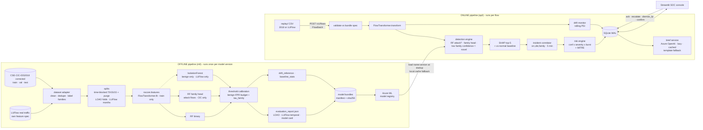

# 03 — NetSentinel Final Architecture

> **One line:** NetSentinel detects attacks with a Random Forest and names them with a second forest; when it detects an attack but can't say which family, it calls it **unfamiliar** (a novel variant). The output is grouped into explained, **risk-scored incidents** for a SOC analyst. *Measured, not assumed: a benign-only anomaly detector did not work on these flows, while the supervised forest generalised to attacks it had never seen (`docs/experiments.md`).* It's trained and tested on CSE-CIC-IDS2018 and shown working on real traffic (LUFlow). Nothing is ever auto-blocked.

## 1. System overview



**Design principles**
1. **Separate offline and online pipelines** (kept from Doc B). Serving never imports training-only dependencies.
2. **One shared core (`nscore/`)** for anything that must behave the same in training and serving: feature transform, fusion, risk engine, drift math, bundle loading. This prevents train/serve skew by construction.
3. **Spec-driven, so dataset-agnostic.** Every bundle carries its own `feature_spec.json`. The same code trains and serves a CIC-schema model (2018) and a LUFlow-schema model, with no dataset-specific branches downstream of the adapters.
4. **Contract first.** `nscore/contracts/` (schemas, policy, fixtures) is the only coupling between components, so five people can build in parallel.
5. **Honest by default.** Thresholds come from an FPR budget, every claim has a matching metric, and the limitations are written down.
6. **Demo-proof.** Every external dependency (Azure ML, Azure OpenAI, Wi-Fi) has a local fallback.

## 2. Repository layout

```
netsentinel/
├─ nscore/                 shared core library (pip install -e .)
│  ├─ contracts/           schemas.py · policy.py (risk engine) · feature_spec*.json · fixtures/   ← the contract
│  ├─ features/            FlowTransformer (M1)
│  ├─ detection/           fusion.py (M2)
│  ├─ drift/               PSI + reference builder (M1)
│  └─ bundle/              manifest, packager, loader w/ Azure ML + cache (M2)
├─ ml/                     offline pipeline: data/ (adapters/) train/ evaluate/ explain/ registry/   (M1, M2)
├─ api/                    FastAPI service: app/ (routers, services, repo) tests/         (M3, M5 brief)
├─ dashboard/              Streamlit SOC console: app.py, pages/                          (M4)
├─ replay/                 replay engine + scenarios/*.yaml                               (M5)
├─ infra/                  docker-compose, Azure provisioning scripts                     (M3)
├─ notebooks/              EDA + experiments (never imported by code)
├─ data/                   gitignored: raw/ processed/ splits/ replay/
├─ artifacts/              gitignored: bundles, cache
├─ tests/                  cross-cutting tests (contracts, train/serve parity)
└─ docs/                   this folder + model_card.md + threat_model.md + runbooks
```

## 3. Offline pipeline

### 3.0 Datasets: two datasets, two jobs

The PS names datasets "only as examples"; the rule is free and public.

| Dataset | Job | Why this one | Feature schema |
|---|---|---|---|
| **CSE-CIC-IDS2018, corrected** (Liu, Engelen et al., IEEE CNS 2022) | **Train, validate, test** (P1, P2) | A large AWS network (420 machines, 30 servers, 50 attacker machines), 10 capture days, 7 attack scenarios with many tools (Patator, Hulk, GoldenEye, Slowloris, LOIC-HTTP/UDP, **HOIC**, DVWA web attacks, infiltration, Ares botnet). Labels were manually audited and the extractor bugs fixed. | CIC (fixed CICFlowMeter, ~80 features) |
| **LUFlow** (Lancaster University honeypots, labelled via threat intelligence) | **Real-world showcase** (P3): its own bundle, served live in the demo | Real internet attack traffic on a real university network, collected continuously since 2020, so it has real drift. Its `outlier` label ("abnormal but unexplained") is exactly what the novelty detector targets. | LUFlow (16 CSV fields → 9 features): `feature_spec.luflow.json` |

Downloads: distrinet-research.be/CNS2022 (corrected 2018 + fixed CICFlowMeter) · github.com/ruzzzzz/LUFlow (or Kaggle).

**2018 attack schedule** (from the CIC dataset page), which drives the split design. Each attack runs for about 1 hour inside a normal working day:

| Day | Attacks |
|---|---|
| Wed 14-02 | FTP-BruteForce, SSH-BruteForce |
| Thu 15-02 | DoS-GoldenEye, DoS-Slowloris |
| Fri 16-02 | DoS-SlowHTTPTest, DoS-Hulk |
| Tue 20-02 | DDoS-LOIC-HTTP, DDoS-LOIC-UDP |
| Wed 21-02 | DDoS-LOIC-UDP, **DDoS-HOIC** |
| Thu 22-02, Fri 23-02 | Web: Brute Force, XSS, SQL Injection |
| Wed 28-02, Thu 01-03 | Infiltration (malicious download → internal Nmap scan) |
| Fri 02-03 | Botnet (Ares) |

**Size (measured):** **63.2M raw flows (45.2M after removing exact duplicates)**, 36 GB of CSV inside a 10.4 GB zip. M1 never unzips: it streams each CSV in ~400 MB in-memory chunks (the streaming reader on a zip member was 40x slower), writes float32 parquet (8 GB), and builds a fixed-seed working sample of 3.5M train / 1.9M validation / 2.0M test flows, which trains comfortably on a 16 GB laptop. Full counts, dataset quirks and every drop decision: `docs/data_profile.md`. **LUFlow:** 63.0M raw flows in the 72-day subset (44.9M clean). About 10% of its `time_start` values are corrupted by the source and are repaired in the adapter; 9 features survive the spec.

**Check on first download:** the corrected files must contain `Src IP`, `Dst IP` and `Timestamp` (the incident correlator and the time-blocked split need them). The original 2018 CSVs lack IPs on most days. That's one more reason to use only the corrected release.

**Dataset adapters** (`ml/data/adapters/{cic2018,luflow}.py`) turn each source into one canonical frame: metadata columns + features (named per the matching feature spec) + `family` + `period` (day or month). Everything downstream reads only that frame.

### 3.1 Data → families
- Drop from features, keep as metadata: `Flow ID`, `Src IP`, `Dst IP`, `Src Port`, `Timestamp`. `Dst Port` is an open experiment: run it both ways and document the result (B12).
- Inf/NaN: count them per column, then drop or clip them, and record the counts in `data_profile.md`. Remove exact duplicates.
- **2018 label mapping → `AttackFamily`** (counts: `data/README.md`): SSH-BruteForce → `BruteForce` (FTP-Patator is 100% `Attempted`, so it is benign) · DoS GoldenEye/Slowloris/Hulk → `DoS` (SlowHTTPTest is absent from the corrected release) · DDoS LOIC-HTTP/LOIC-UDP/HOIC → `DDoS` · Web Brute Force/XSS/SQL Injection → `WebAttack` · Infiltration (all stages) → `Infiltration` · Ares → `Botnet`. "Attempted" labels in the corrected set → `BENIGN`, as the dataset authors recommend. Never treat them as their own class.
- **Low-support rule:** any family with < 1,000 clean flows is flagged low-support. Measured: **`WebAttack` has only 283 flows** (every other family has ≥ 89k). It stays a named family (keeps its own severity 0.6 and MITRE T1190), uses `class_weight`, is reported with a caveat, and is **excluded from LOAO**. Merge it into `Rare` only if M2 finds it unlearnable.
- **LUFlow mapping:** `benign` → `BENIGN`, `malicious` → attack (binary only; the family is `Malicious`), `outlier` → **left out of supervised training**, kept as a separate label to measure novelty capture.
- Correlation pruning (|ρ| > 0.95, keep the more interpretable feature) on the 2018 train split only → `nscore/contracts/feature_spec.json`.

### 3.2 Evaluation protocol

| Protocol | How | Answers | Used for |
|---|---|---|---|
| **P1 time-blocked + purge** (2018) | For each (day, label) group, sort by timestamp: first 70% → train, next 15% → val, last 15% → test. **Drop flows within 60 s of each block boundary (purge)** so a single attack session can't sit on both sides. Indices are saved to `data/splits/` so every run uses the exact same split. | How well do we detect *known* families? | Main per-class metrics, threshold tuning (val), model card |
| **P2 LOAO** (2018) | For each family F in {DoS, DDoS, BruteForce, Infiltration, Botnet} (WebAttack is too small for a held-out test): remove F completely from training of BOTH heads, retrain on a fixed-size sample, then measure recall on F's test flows at benign-FPR budgets 0.01-0.5% (3 seeds, mean and range), and how many detections the family head labels **novel**. | **Can we catch a family we've never seen?** | The headline chart: held-out recall per family vs the same model trained WITH it (`seen ceiling`). Result: floods, DoS and botnet generalise; SSH brute force and internal scans do not |
| **P2b tool holdout** (2018) | Retrain without ONE tool whose siblings stay (DDoS-HOIC, LOIC-HTTP, Hulk, GoldenEye, Slowloris). HOIC is excluded from hyper-parameter tuning so it is an untouched check. | Does the model learn **behaviour**, not tools? Does it flag an unfamiliar *variant* of a known family? | `kind=tool` rows in the report + a Q&A answer |
| **P3 real-world temporal** (LUFlow) | Same pipeline with `feature_spec.luflow.json`: train RF + IForest on the earliest months, test month by month afterwards (recall, FPR, PSI over time). Also measure the share of `outlier` flows flagged by the IForest vs the RF (the only place the benign-only detector is evaluated against real unexplained traffic). | Does it hold on real traffic, and how fast does it decay? | Real-world showcase, **measured drift curve** |
| **P3b recalibration** (LUFlow) | Refit only the IF + thresholds on a **label-free recent benign window** from a later month, then re-test that month. | Can we recover from drift without new labels? | Drift → recalibrate → recover story, demo act 5 |

Metrics reported per class: precision, recall, F1, **FPR**, support, one-vs-rest ROC-AUC. Overall: macro-F1, binary ROC-AUC and PR-AUC, benign FPR at the operating point. Confusion matrix saved as PNG and JSON. Probability calibration checked with a reliability plot. P2b and P3/P3b go into `EvaluationReport.external`.

Why not a day-based split: in 2018, as in 2017, each attack lives on one or two specific days. Splitting by day would leave whole families out of training. Leaving a family out on purpose is what LOAO does, deliberately and measurably.

### 3.3 Models

| Model | Train on | Role | Notes |
|---|---|---|---|
| `rf_binary` | all train flows | p(attack) | 100 trees, depth 16, 100 samples per leaf, 20% of features per split, no class weights. **Tuned on held-out-tool recall** (in-distribution accuracy is saturated); class weights vs SMOTE made no measurable difference. Tiny: ~5 MB. |
| `rf_multiclass` | attack flows only | which family + **probabilities per family** (feed expected severity) and its **confidence** (max probability), which is the novelty signal | CIC bundles only. LUFlow has no family labels, so its bundle has `family_head = False`. |
| `iforest` | **benign train flows only** | anomaly percentile of benign val scores | **Optional, LUFlow bundles only.** On CIC flows it scored ROC-AUC 0.70-0.87 and ~0 recall at a usable false-alarm rate (`docs/experiments.md` §4), so CIC bundles do not ship one. |

**Thresholds (M2-07):** `tau_binary` = the lowest threshold whose benign FPR on validation is ≤ the **operating budget (0.1%)**; `tau_family` = the family-confidence level below which only 2% of *familiar* validation attacks fall (so about 2% of familiar attacks get a false "novel" label, measured on test). The full trade-off (budgets 0.01%-1%) ships in the bundle as `operating_curve.json`. Why 0.1% and not the 1% first planned: at this network's scale (~330k benign flows per hour) 1% is thousands of false alarms an hour and cuts precision at natural prevalence from 99.9% to 87%. Even 0.1% is hundreds per hour before the correlator groups them (§4.3). **All precision and counts are weighted to the real class balance** (the val/test samples keep every attack but only a quarter of benign flows).

### 3.4 Explainability
- `shap.TreeExplainer` on `rf_binary`: it explains *why the flow was flagged as an attack*, which holds for known and novel verdicts alike. Exact TreeSHAP costs ~50-110 ms per flow, so the API explains a few representative flows per incident (`fast` mode = first 25 trees) rather than every flow of an alert storm.
- Each alert gets the top 5 `{feature, raw value, shap_value, benign median}`. The benign median comes from `baseline_stats.json` and lets the UI say "this flow's inter-arrival time is 4,000× shorter than normal".
- Global importance is precomputed for the Model page.
- **SHAP never changes the risk score.** One number decides the order, one explanation builds trust.
- Latency budget: detection is milliseconds; SHAP is the slow part (see above).

### 3.5 Model bundle (the offline → online contract)

```
bundle_vN/
  manifest.json            BundleManifest: version, dataset, split, feature_spec sha256, file sha256s, metrics
  feature_spec.json        ordered features, clip/log rules (CIC or LUFlow schema)
  transformer.joblib       fitted FlowTransformer
  rf_binary.joblib
  rf_multiclass.joblib     (absent when family_head = False)
  iforest.joblib           OPTIONAL (LUFlow bundles)
  iforest_benign_val_scores.npy   OPTIONAL, for score -> percentile
  thresholds.json          {"tau_binary", "tau_family", "operating_fpr"} (+ "tau_anomaly" with an IForest)
  operating_curve.json     benign FPR / recall / precision per false-alarm budget, per-family recall
  global_importance.json   mean |SHAP| per feature (Model page)
  label_map.json           class index -> AttackFamily
  drift_reference.json     quantile bins + proportions, top-15 features + reference attack rate
  baseline_stats.json      benign median / p95 per feature
  evaluation_report.json   EvaluationReport schema
  confusion_matrix.png, loao.png, reliability.png
```

Bundles in the registry (each one versioned and tagged):

| Bundle | Trained on | Used for |
|---|---|---|
| `netsentinel-bundle:N` | 2018, all families | Main demo and evaluation |
| `netsentinel-demo-holdout-botnet:N` | 2018 **without Botnet** | Demo act 4: "this model has never seen a botnet" |
| `netsentinel-luflow:N` | LUFlow earliest months | Demo act 5: real traffic |
| `netsentinel-luflow-recal:N` | same RF, IF + thresholds refit on a recent benign window | Demo act 5: drift recovery |

The manifest's `feature_spec_sha256` stops the API from scoring CIC flows with a LUFlow bundle, and vice versa.

### 3.6 Registry
Azure ML workspace. `MLClient.models.create_or_update` with tags `{dataset, split, contract_version, feature_schema, macro_f1, benign_fpr, held_out}`. The API resolves `MODEL_REF=azureml:netsentinel-bundle@latest`, downloads it to `artifacts/cache/`, and verifies the sha256s. If Azure is unreachable, it falls back to the cached copy. `local:` refs are supported for development.

## 4. Online pipeline (FastAPI)

### 4.1 Endpoints (`/v1`, all bodies are contract models)

| Method | Path | Body / query | Returns | Notes |
|---|---|---|---|---|
| GET | `/health` | | `{status, model_loaded, model_version}` | liveness + readiness |
| GET | `/v1/model` | | `ModelInfo` | includes `feature_schema` and `family_head`, so the UI adapts |
| GET | `/v1/model/evaluation` | | `EvaluationReport` | feeds the Model page |
| POST | `/v1/flows` | `FlowBatch` (≤ 500) · header `X-API-Key` | `ScoreBatchResponse` | validates against the **loaded bundle's** feature spec → transform → fuse → SHAP (non-benign only) → correlate → risk → persist |
| GET | `/v1/incidents` | `status, verdict, family, level, since, limit, offset, sort=risk\|last_seen` | `IncidentPage` | |
| GET | `/v1/incidents/{id}` | | `IncidentDetail` | |
| POST | `/v1/incidents/{id}/actions` | `AnalystActionIn` · header `X-Analyst` | `AnalystActionRecord` | updates status, writes audit log |
| GET | `/v1/incidents/{id}/brief` | `refresh=false` | `Brief` | lazy, cached, 8 s timeout → template fallback |
| GET | `/v1/drift` | | `DriftReport` | |
| GET | `/v1/metrics` | | `LiveMetrics` | throughput, p50/p95 latency, confirmed precision, MTTA |
| POST | `/v1/admin/reload-model` | `{model_ref}` · admin key | `ModelInfo` | switches the demo between bundles (2018 → holdout → LUFlow → LUFlow-recal) and starts a fresh drift window |

**Mock mode** (`NS_MOCK=1`): every GET serves `nscore/contracts/fixtures/*.json`. This is ready on day 1 so the dashboard isn't waiting on the backend.

### 4.2 Scoring path for one flow
```
FlowRecord → transformer.transform_records → x          (rejects flows missing spec features: 422)
p = rf_binary.predict_proba(x)[1]
if p >= tau_binary and family_head:
    probs = rf_multiclass.predict_proba(x); closest = argmax(probs); fconf = max(probs)
v = fuse(p, a, tau_binary, tau_anomaly, fconf, tau_family)   # a = IForest percentile (LUFlow only, else 0)
if v == KNOWN_ATTACK:  family = closest if family_head else Malicious;  conf = p
if v == NOVEL_ANOMALY: family = Unknown (closest_family = closest, family_confidence = fconf);  conf = p
if v != BENIGN:
    sev  = policy.expected_severity(family, probs)
    top5 = shap(explainer_for(v), x) joined with baseline_stats
    incident = correlator.upsert(meta, v, family, conf, sev, top5)
    incident.risk = policy.risk_score(v, incident.max_confidence, incident.severity, incident.flow_count)
drift_monitor.observe(x, v)        # every flow, benign included
```

### 4.3 Incident correlator
- Key: `(src_ip, dst_ip, family)`. Novel anomalies use `(src_ip, dst_ip, "Unknown")`.
- Window: an open incident absorbs a matching flow if `flow.observed_at − incident.last_seen ≤ 5 min` and the incident's status isn't `resolved` or `dismissed_fp`.
- On upsert: `flow_count += 1`, `max_confidence = max(...)`, `severity` = running mean of the flows' expected severity, `last_seen`, a running mean of |SHAP| per feature for the top 5, and a recomputed risk.
- The effect: replaying a 50k-flow DDoS-HOIC attack produces about one incident per source/destination pair. Report the flows-to-incidents ratio. It's a strong slide.

### 4.4 Risk engine (`nscore/contracts/policy.py`)

This merges the team's **Risk Scoring Pipeline** doc (`docs/reference/NetSentinel_Risk_Scoring_Pipeline.pdf`) with the incident and novelty design. **Confidence measures certainty, severity measures consequence**: a model can be very sure about something harmless.

```
severity   = Σ_f P(f | attack) × W[f]                 expected severity over the family head's probabilities
             binary-only bundle (LUFlow) → W[Malicious] · novel anomaly → W[Unknown]
confidence = p_attack (known attack)  |  novel_confidence(anomaly percentile) (novel anomaly)
burst      = 1 + 0.15 × min(1, log10(flow_count) / 3)          1 flow → 1.00 · ≥1000 flows → 1.15
risk       = min(100, round(100 × (confidence × severity × burst + novelty_bonus)))   novelty_bonus = 0.10
level      = HIGH ≥ 70 · MEDIUM 40–69 · LOW < 40
```

| Family | W | Why (M5 writes the full reasoning in `docs/threat_model.md`) |
|---|---|---|
| Infiltration | 1.00 | Deepest stage: the attacker is already inside |
| Botnet | 0.90 | A host is likely already compromised |
| DoS / DDoS | 0.80 | Service disruption, high visibility |
| Rare | 0.80 | Merged rare families: treat as serious until triaged |
| Unknown (novel) | 0.75 + 0.10 bonus | Unknown intent, so nothing is assumed safe |
| BruteForce | 0.70 | Active attempt to gain access |
| Malicious (LUFlow) | 0.70 | Malicious per threat intelligence, type unknown |
| WebAttack | 0.60 | Could mean an exploited app, but often fails |
| PortScan | 0.30 | Reconnaissance only (not a 2018 class; kept for live capture) |

**What changed vs the team doc, and why**
- **Expected severity** instead of the single top-family weight. If the classifier is split 50/50 between WebAttack (0.6) and Infiltration (1.0), severity = 0.8, not a coin flip between the two extremes.
- **The burst factor (the doc's Factor 3) is in the baseline**, applied per incident through the correlator, as a multiplier in [1.00, 1.15]. A single flow gets exactly the doc's formula, so the doc's worked examples still hold (62 MEDIUM, 81 HIGH, 28 LOW, all asserted in `tests/test_contracts.py`).
- **Novel anomalies get a score**, instead of being dropped at the 0.5 gate.
- **The FPR-budget threshold replaces the fixed 0.5.**

Worked examples (from the fixtures): Infiltration, 1 flow, conf 0.81 → **81 HIGH** · DDoS-HOIC, 4,210 flows, conf 0.99 → **91 HIGH** · Botnet, 37 flows, conf 0.94 → **91 HIGH** · novel anomaly, 112 flows, conf 0.71 → **69 MEDIUM** · BruteForce, 1 flow, conf 0.88 → **62 MEDIUM** · unsure WebAttack (90/10 with Infiltration), conf 0.58 → **37 LOW**.

### 4.5 Database (SQLite, WAL mode; swap the URL for Azure SQL or Postgres later)

```sql
CREATE TABLE flows (
  flow_id TEXT PRIMARY KEY, observed_at TEXT, received_at TEXT,
  src_ip TEXT, dst_ip TEXT, src_port INT, dst_port INT, protocol INT,
  features_json TEXT, verdict TEXT, p_attack REAL, anomaly_pct REAL,
  attack_family TEXT, severity REAL, incident_id TEXT REFERENCES incidents(incident_id),
  ground_truth TEXT, model_version TEXT, latency_ms REAL
);
CREATE TABLE incidents (
  incident_id TEXT PRIMARY KEY, status TEXT DEFAULT 'new', verdict TEXT, attack_family TEXT,
  mitre_id TEXT, mitre_name TEXT, risk_score INT, risk_level TEXT, severity REAL, max_confidence REAL,
  flow_count INT, src_ip TEXT, dst_ip TEXT, dst_port INT, first_seen TEXT, last_seen TEXT,
  top_features_json TEXT, brief_json TEXT, model_version TEXT,
  acknowledged_at TEXT, updated_at TEXT
);
CREATE TABLE analyst_actions (
  action_id INTEGER PRIMARY KEY AUTOINCREMENT, incident_id TEXT REFERENCES incidents(incident_id),
  analyst TEXT NOT NULL, action TEXT NOT NULL, note TEXT, at TEXT DEFAULT CURRENT_TIMESTAMP
);
CREATE TABLE drift_snapshots (
  id INTEGER PRIMARY KEY AUTOINCREMENT, computed_at TEXT, model_version TEXT, window_size INT,
  status TEXT, max_psi REAL, report_json TEXT
);
CREATE INDEX ix_inc_open ON incidents(status, risk_score DESC);
CREATE INDEX ix_inc_key  ON incidents(src_ip, dst_ip, attack_family, last_seen);
```
Benign flows: keep at most N recent ones (configurable), because drift only needs the rolling window.

### 4.6 Drift monitor
- Rolling window of the last 2,000 transformed flows. Every 500 flows it computes PSI for each of the top-15 features against the **loaded bundle's** `drift_reference.json`, plus the predicted attack rate compared with the reference rate.
- Status: max PSI < 0.10 is `ok`, < 0.25 is `watch`, anything higher is `alert`. Each check writes a snapshot. Alert status shows a "consider recalibrating" banner linked to `docs/runbook_retrain.md`.
- Within 2018 the benign traffic is scripted, so expect little drift there. **The real drift story is LUFlow**: replaying a later month through the LUFlow bundle pushes PSI to `alert`, and the recalibrated bundle brings it back.

### 4.7 Brief service (Azure OpenAI)
- Input: structured incident JSON only (family, verdict, confidence band, risk level, flow count, top features with raw values and benign medians, MITRE ID, IPs and port). No raw payloads.
- System prompt (extends Doc B §6): write 3–4 sentences covering what was seen, why it was flagged (only from the given features), and one suggested next step. Don't invent details. **Hedge to match the confidence band.** For `novel_anomaly`, say plainly that no known family matched. For `Malicious` (LUFlow), don't guess a type.
- Generated when first requested, then cached in `incidents.brief_json`. Times out after 8 s and falls back to a deterministic template brief (`source: "template"`). A failed brief never blocks the queue.
- Config comes only from environment variables: `AZURE_OPENAI_ENDPOINT`, `AZURE_OPENAI_API_KEY`, `AZURE_OPENAI_DEPLOYMENT`, `AZURE_OPENAI_API_VERSION`.

### 4.8 Security and ops of the system itself
- `X-API-Key` on ingest, `X-Analyst` (name + role) on actions, admin key on reload. Secrets live in `.env`, never in git, and CI runs secret scanning.
- Structured JSON logs with a request ID. p50/p95 latency is exposed in `/v1/metrics`.
- Pydantic validation rejects malformed flows with a 422 that names the missing feature.

## 5. SOC console (Streamlit)

| Page | Shows | Key interactions |
|---|---|---|
| **Live Queue** | Incidents sorted by **risk score**. HIGH red, MEDIUM amber, LOW grey. Chips for `Known attack` and `Novel anomaly`. Header counters: open HIGHs, novel anomalies, flows/sec. Auto-refreshes every 3 s and highlights new rows. A badge shows which bundle is loaded (2018 / LUFlow). | filter by status/verdict/family/level, click through to detail |
| **Incident Detail** | **Risk breakdown** (confidence × severity × burst = score) · SHAP bar chart · **"vs normal"** table (value vs benign median) · MITRE badge · flow metadata · brief panel (loading, LLM or template label) · action timeline | Acknowledge / Escalate / Confirm / Dismiss as FP, with a note |
| **Model & Evaluation** | Model version and registry ref · per-class table · confusion matrix · **LOAO chart** · **Real-world panel** (LUFlow month-by-month + recalibration, from `external`) · operating FPR · limitations | — |
| **Drift & Health** | PSI per feature against the 0.10/0.25 lines · status banner · throughput · latency | — |
| **Analyst Metrics** | Analyst-confirmed precision · FP dismiss rate · MTTA · actions per analyst | — |

When `family_head` is false (LUFlow bundle), the UI hides family-specific widgets (MITRE, confusion matrix) instead of showing empty ones. Analyst sign-in is a name plus a role in session state, sent as `X-Analyst`. React stays a stretch goal and uses the same API.

## 6. Demo storyline (≈ 5 min)
1. **Calm.** 2018 benign replay runs, the queue is empty, drift is `ok`, and the model page shows v N from Azure ML.
2. **Known attack.** A brute-force burst arrives as one incident, mapped to MITRE T1110. Open it and show the **risk breakdown** ("88% sure × severity 0.7 × burst"). Generate the brief, then Escalate.
3. **Alert storm.** Replay DDoS-HOIC: thousands of flows become **one HIGH incident**. "That's the alert-fatigue answer."
4. **The novel attack.** Reload the **holdout bundle** (trained without any botnet) and replay Ares botnet traffic. The forest still flags it, but the family head can't place it, so the incident appears as **Novel anomaly** ("closest known family: X, 55% sure") with a SHAP explanation. Then reload the full bundle: the same traffic becomes a named **Botnet** incident. Show the LOAO chart: "measured across every family, not just this demo".
5. **Real traffic.** Reload the **LUFlow bundle** and replay real honeypot traffic from a **later month**. Real attackers show up as incidents, unexplained `outlier` traffic gets flagged as novel, and **drift jumps to `alert`** because the internet changed since training. Reload **LUFlow-recal** (refit on a recent benign window, no labels needed) and drift drops back to `ok`. Show the month-by-month chart.
6. **Honesty.** Dismiss a low-confidence incident as a false positive and the analyst-confirmed precision updates live. Walk through the limitations slide.
7. Fallbacks: a recorded video of acts 1–6. Briefs fall back to the template if Azure OpenAI is unreachable. Bundles load from the local cache if Azure ML is unreachable.

## 7. Tech stack

| Layer | Choice | Why |
|---|---|---|
| ML | scikit-learn, imbalanced-learn, shap, pandas/pyarrow | It's what the PS names, it's fast on a laptop, and TreeSHAP is exact and quick |
| Registry | Azure ML (SDK v2) + local cache | Real use of Microsoft tooling, with a demo fallback |
| API | FastAPI, Uvicorn, Pydantic v2, SQLAlchemy Core / sqlite3 | Contract-typed and quick to build |
| LLM | Azure OpenAI (gpt-4o-mini class deployment) | Cheap, quick, and a Microsoft service |
| UI | Streamlit + Plotly | Fast to build. React is a stretch goal |
| Infra | Docker Compose (api + dashboard). Optional deploy to Azure Container Apps | One command runs the demo |
| CI | GitHub Actions: ruff, pytest, gitleaks | Required checks on PRs |

## 8. Requirements traceability

| PS requirement | Where it's met | Evidence on demo day |
|---|---|---|
| Normal vs attack + attack types | `rf_binary`, `rf_multiclass` | Family label on every 2018 incident |
| Surfaces **novel** attacks | binary RF generalisation + family-head confidence (`fusion.fuse`) | Demo act 4 + leave-one-out tables (floods/DoS yes; botnet and SSH brute force only at 0.1-0.5% budgets; Nmap scans and LOIC-HTTP no) + LUFlow outlier capture (act 5) |
| Precision / recall / FPR / AUC | `ml/evaluate` → `EvaluationReport` | Model page, model card |
| Class imbalance | class weights, SMOTE comparison, low-support rule | Model card section + before/after table |
| **Discuss model drift** | `nscore/drift`, `/v1/drift`, drift page, P3/P3b, model card §Drift | **Measured** decay on real traffic (LUFlow month by month), live drift alert and recovery in act 5 |
| Alert SOC, no auto-block | incidents + risk engine + actions + audit log | Demo acts 2–6 |
| Honest evaluation | purged time-blocked split, FPR-budget thresholds, corrected dataset, limitations | Model card, Q&A sheet |
| Works beyond lab data | LUFlow bundle | Act 5 |

## 9. Key decisions (short ADRs)

| # | Decision | Alternatives considered | Why |
|---|---|---|---|
| ADR-1 (**revised after measurement**) | Binary RF detects; family-head confidence marks unfamiliar attacks. IsolationForest optional, LUFlow only | Original: RF + benign-only IsolationForest fusion; autoencoder | We assumed a supervised RF cannot detect unseen attacks and built a benign-only IForest for that. **Measured on CIC-IDS2018: the IForest has ROC-AUC 0.70-0.87 and ~0 recall at a usable false-alarm rate; the supervised RF detects held-out families/tools (floods, DoS, botnet) at strict budgets and the family head's confidence separates unfamiliar from familiar attacks with ROC-AUC 0.997-1.000.** Evidence: `docs/experiments.md` §4-5. Known gaps (test, 3 seeds): internal Nmap scans and the LOIC-HTTP tool are not detected when unseen; SSH brute force (97% at 0.1% budget, 29% at 0.05%) and botnet (66% at 0.1%, 99% at 0.5%) only at looser budgets. |
| ADR-2 | Purged time-blocked per-class split + LOAO | day-based split; random split | A day-based split removes whole families from training. A random split leaks sessions. |
| ADR-3 | Incidents, not per-flow alerts | per-flow alerts | Per-flow alerts make alert fatigue worse, which contradicts the pitch. |
| ADR-4 | Contract-first monorepo with shared `nscore` | separate repos; no contracts | Lets 5 people work in parallel and avoids train/serve skew. |
| ADR-5 | Streamlit first | React first | Hackathon speed. Both call the same API. |
| ADR-6 | SQLite (WAL) | Postgres | Zero setup. Moving later is just a URL change. |
| ADR-7 | Rebuild SHAP explainers at load | pickle explainers | Pickled explainers break across shap versions. Rebuilding costs milliseconds. |
| ADR-8 | Corrected CSE-CIC-IDS2018 for train/val/test; LUFlow as a live real-traffic showcase with its own bundle | CIC-IDS2017; 2017 + 2018 cross-network; NetFlow-v3 family; UNSW-NB15 | 2018 is the larger, more varied labelled network with more attack tools and rare-class examples. The labels are audited. LUFlow adds real traffic and **real drift**, which 2018's scripted benign traffic lacks. One labelled dataset keeps M1's workload realistic. Trade-off: no same-schema cross-network test (accepted). |
| ADR-9 | Risk = confidence × expected severity × burst (+ novelty bonus), 3 levels | raw confidence; per-flow scores; P1–P4 bands | Adopts the team's risk doc (confidence ≠ consequence, 3 levels, defensible weights) and adds expected severity, incident-level burst and novelty scoring. |
| ADR-10 | Operating budget 0.1% benign FPR; all precision weighted to natural prevalence | 1% budget (first plan); raw-sample precision | 1% is thousands of false alarms per hour and 87% precision at real prevalence; the sample-based precision (96%) is inflated by down-sampled benign. 0.1% keeps recall high on floods while staying workable behind the correlator. |
