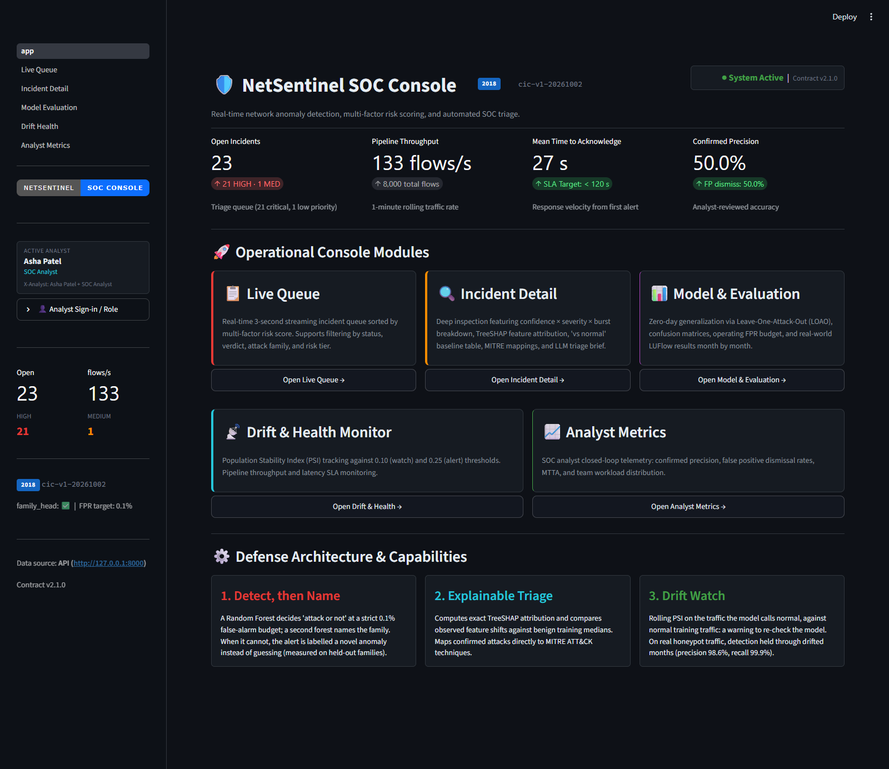
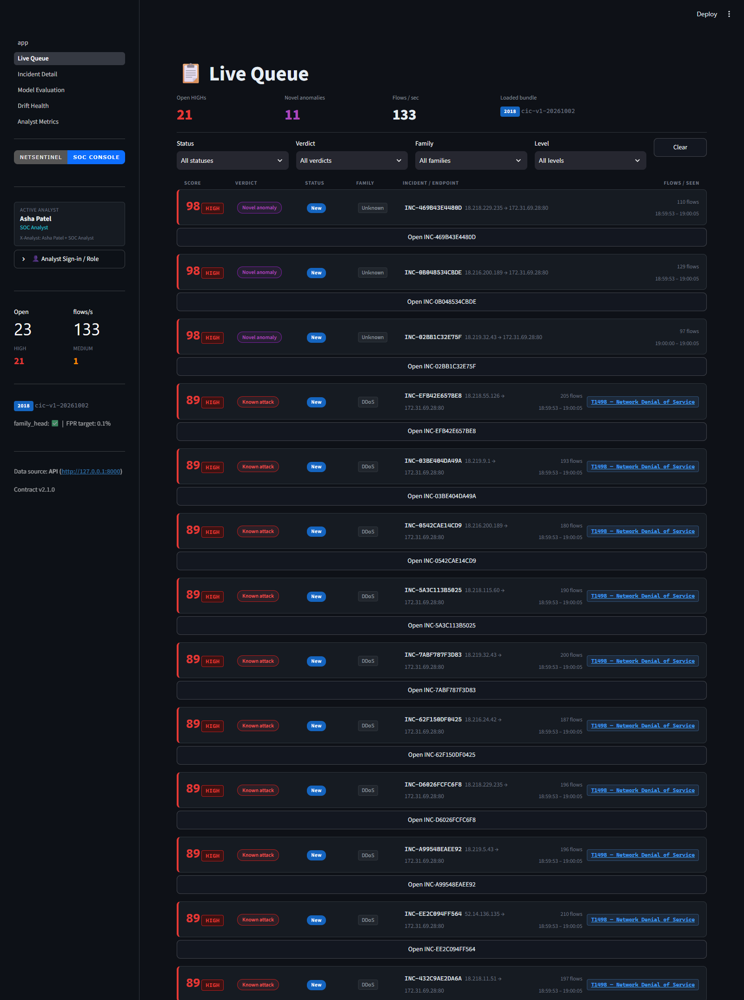
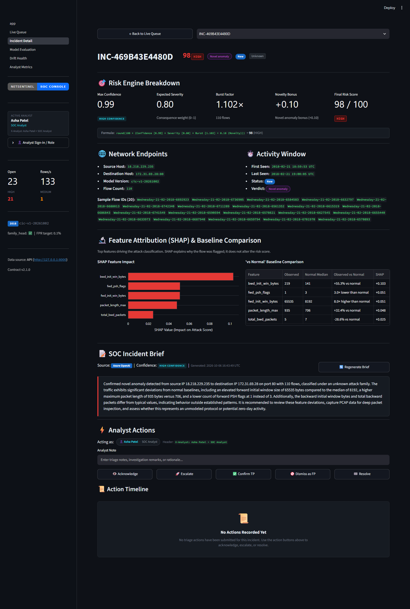
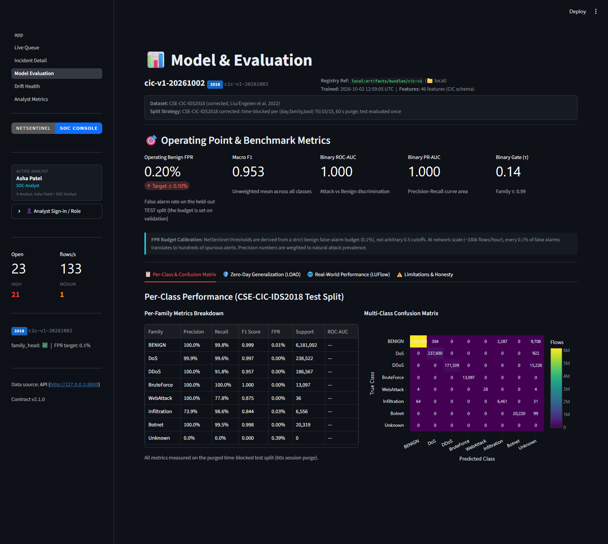
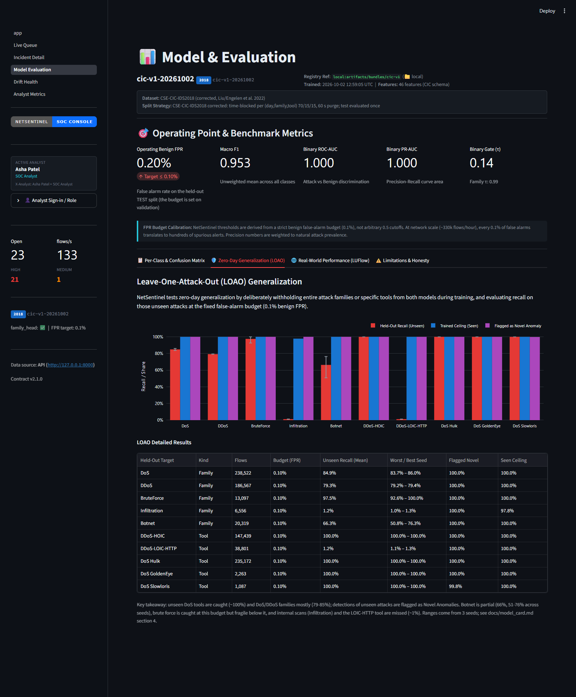
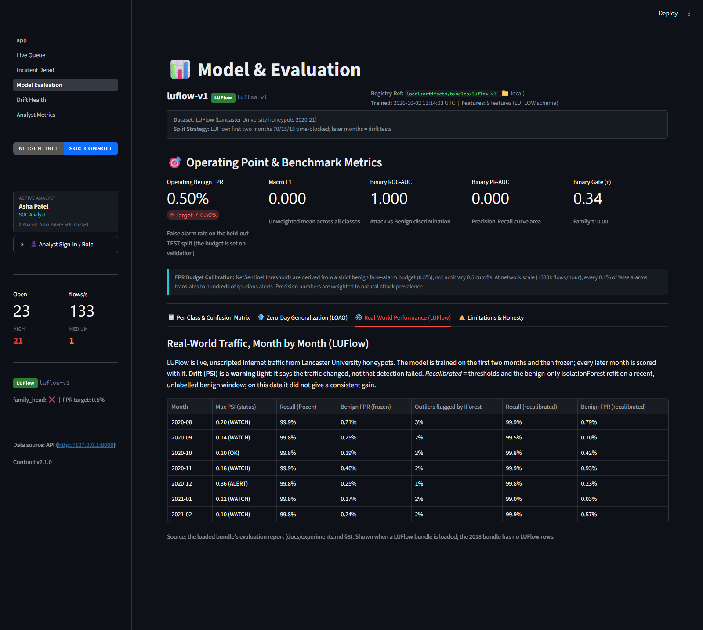
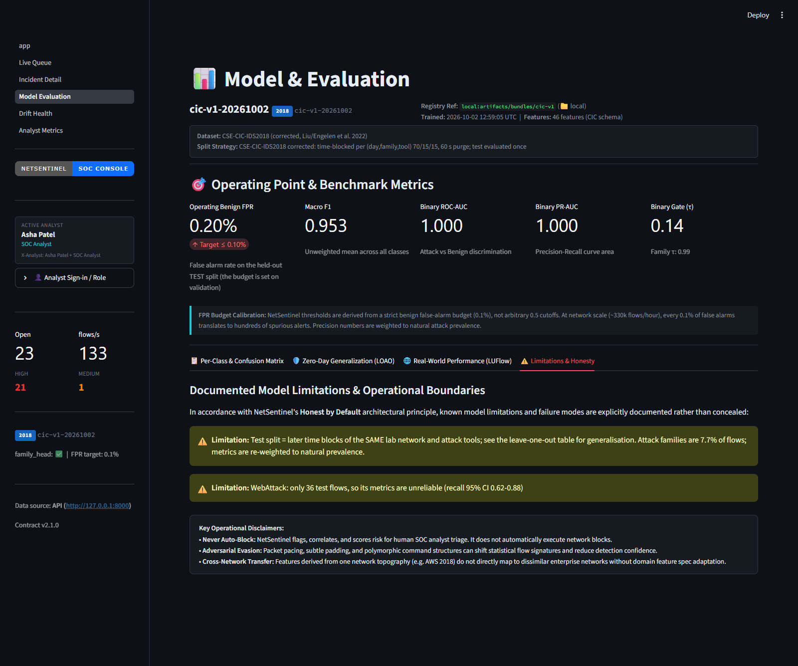
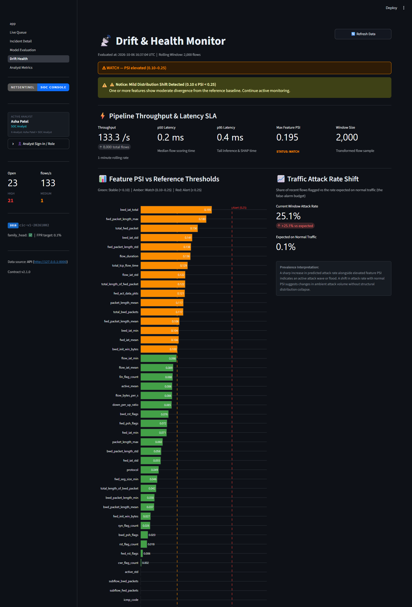
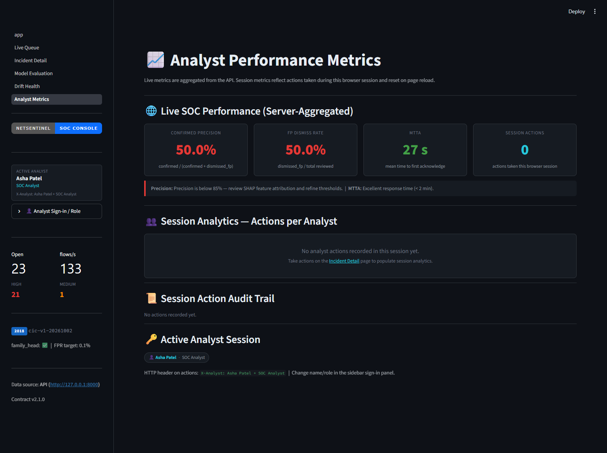

# NetSentinel SOC Console: Complete Dashboard Guide

*What every page, panel and number on the dashboard means, where it comes from, and how an analyst uses it.*
*Screenshots: live run on 2026-10-06 against the real `cic-v1` model, 8,000 replayed flows (3,000 normal, 2,000 SSH brute force,
3,000 DDoS, 1,500 more normal), one Azure OpenAI brief, and four test analyst actions (two on the brute-force incident:
acknowledge and confirm; two on a low-risk incident: acknowledge and dismiss as false positive).*

---

## 1. What the dashboard is for

NetSentinel is an ML layer that sits next to a signature IDS. It scores every network flow, groups suspicious flows into
**incidents**, ranks them by **risk**, explains **why** each was flagged, and leaves the decision to a human. The dashboard
(the "SOC Console", built with Streamlit in `dashboard/`) is the analyst's screen for that work.

Three rules shape every page:

1. **Rank, don't flood.** Thousands of flows become a short queue ordered by risk.
2. **Explain everything.** Every incident shows the numbers behind its risk score and the features that made the model flag it.
3. **Never auto-block.** The dashboard records analyst decisions; it never blocks traffic.

### How the pieces connect

```
replay/replay.py ──flows──► API (FastAPI, api/app/) ──► model bundle (Random Forests + SHAP)
                                   │   incidents, risk, MITRE, drift, metrics (SQLite)
                                   ▼
                     Dashboard (Streamlit, dashboard/) ◄── analyst actions (acknowledge, dismiss…)
                                   │
                         "Generate Brief" ──► Azure OpenAI (gpt-4.1-mini) ── or template fallback
```

- The **dashboard never talks to the model directly**: it reads everything from the API through `dashboard/api_client.py`,
  typed with the shared contracts in `nscore/contracts/schemas.py`.
- Two data sources: **live** (`NS_API_URL=http://127.0.0.1:8000`) or **offline** (`NS_OFFLINE=1`), which shows the built-in
  sample data from `nscore/contracts/fixtures/` so the UI can be shown without a backend.

---

## 2. The sidebar (on every page)

| Element | What it shows | Where it comes from |
|---|---|---|
| **Page links** | `app` (Home), Live Queue, Incident Detail, Model Evaluation, Drift Health, Analyst Metrics | Streamlit multipage navigation |
| **NETSENTINEL · SOC CONSOLE** | Product badge | static |
| **Active Analyst card** | Signed-in name and role (default "Asha Patel · SOC Analyst") and the exact header sent with actions: `X-Analyst: Asha Patel + SOC Analyst` | browser session state |
| **Analyst Sign-in / Role** | Expand to change name and role (SOC Analyst, Tier-2 Analyst, Incident Responder, Threat Hunter, Manager). Every action is recorded under this identity in the audit log. Characters the API does not accept are replaced by spaces. | `theme.get_analyst()` |
| **Open / flows/s / HIGH / MEDIUM** | Open incidents, current throughput, open HIGH and MEDIUM counts | `GET /v1/metrics` |
| **Bundle badge** | Which model is serving, e.g. `2018 · cic-v1-20261002` (or `LUFlow · luflow-v1`) | `GET /v1/model` |
| **family_head / FPR target** | Whether the model can name attack families (true for 2018, false for LUFlow) and the false-alarm budget it was calibrated to (0.1%) | `GET /v1/model` |
| **Data source** | `API (http://127.0.0.1:8000)` or `offline` | environment |
| **Contract v2.1.0** | Version of the shared data contract between API and dashboard | `nscore/contracts` |

When the API is unreachable, every page shows an **API-down banner** instead of crashing.

---

## 3. Home (`app`)



The landing page: a status summary and the way into the five working pages.

### 3.1 Header
- **NetSentinel SOC Console**, the loaded model's badge (`2018`) and version (`cic-v1-20261002`).
- **System Active · Contract v2.1.0**: green when the API answers.

### 3.2 Summary tiles (from `GET /v1/metrics`)

| Tile | Screenshot | Meaning |
|---|---|---|
| **Open Incidents** | 23 (21 HIGH · 1 MED) | Incidents not yet resolved or dismissed. The badge splits them by risk level. |
| **Pipeline Throughput** | 133 flows/s · 8,000 total | Flows scored in the last 60 s ÷ 60, and the total scored since start. |
| **Mean Time to Acknowledge** | 27 s (SLA target < 120 s) | Average time from when an incident reached the SOC (its first flow arrived) to the first "acknowledge". Green under 2 minutes. |
| **Confirmed Precision** | 50.0% (FP dismiss 50.0%) | Of the incidents an analyst reviewed, the share confirmed as real attacks: confirmed ÷ (confirmed + dismissed as false positive). 50% here only because the test run confirmed one and dismissed one. |

### 3.3 Operational Console Modules
Five cards, each with a one-line description and an **Open … →** button: Live Queue, Incident Detail, Model & Evaluation,
Drift & Health Monitor, Analyst Metrics.

### 3.4 Defense Architecture & Capabilities
1. **Detect, then Name**: one Random Forest decides "attack or not" at a strict 0.1% false-alarm budget; a second names the
   family; when it cannot, the alert is labelled a novel anomaly instead of guessing.
2. **Explainable Triage**: exact TreeSHAP explanations compared with normal-traffic medians; MITRE ATT&CK mapping.
3. **Drift Watch**: rolling PSI on normal traffic as a warning light; detection on real honeypot traffic held through drifted months.

---

## 4. Live Queue: the analyst's main screen



### 4.1 Header counters
| Counter | Screenshot | Meaning |
|---|---|---|
| **Open HIGHs** | 21 | Open incidents with risk level HIGH (score ≥ 70) |
| **Novel anomalies** | 11 | Open incidents the model flagged as attacks but could not assign to a known family |
| **Flows / sec** | 133 | Current throughput |
| **Loaded bundle** | `2018 · cic-v1-20261002` | Which model produced these incidents |

### 4.2 Filters
**Status** (new, acknowledged, escalated, dismissed_fp, resolved), **Verdict** (known attack, novel anomaly), **Family**
(DoS, DDoS, BruteForce, Botnet, Infiltration, WebAttack, Malicious, Unknown…), **Level** (HIGH, MEDIUM, LOW), and **Clear**.
They are passed to `GET /v1/incidents`. Pagination (10/25/50/100 per page, Prev/Next) sits at the bottom.

### 4.3 Incident rows (always sorted by risk score, highest first)
| Column | Example | Meaning |
|---|---|---|
| **Score + level** | `98 HIGH` | Risk score 0-100 and its band: HIGH ≥ 70, MEDIUM ≥ 40, LOW below |
| **Verdict** | `Novel anomaly` / `Known attack` | Known = the family model recognised the attack; Novel = attack detected, family unknown |
| **Status** | `New` | Where the incident is in triage |
| **Family** | `DDoS` / `Unknown` | Attack family (Unknown for novel anomalies) |
| **Incident / Endpoint** | `INC-469B43E4480D 18.218.229.235 → 172.31.69.28:80` | Incident ID, source → destination:port |
| **Flows / Seen** | `110 flows · 18:59:53 - 19:00:05` | How many flows were grouped into it, first and last time seen (UTC, original traffic time) |
| **MITRE badge** | `T1498 – Network Denial of Service` | ATT&CK technique for the family (link) |

**Open INC-… →** under each row opens it in Incident Detail. The list **refreshes every 3 seconds** while traffic arrives.

### 4.4 How flows become incidents (the correlator, `api/app/correlator.py`)
- Key = **(source IP, destination IP, family)**; novel anomalies use family "Unknown".
- A flow joins the open incident with the same key if it arrives within **5 minutes** of that incident's last flow;
  otherwise it starts a new incident. Closed incidents (resolved, dismissed) never absorb new flows.
- On each merge: flow count +1, maximum confidence, running mean of severity, last-seen time, the mean SHAP explanation,
  and the risk score are recomputed.
- Effect, measured: 10,000 SSH brute-force flows → **1** incident; 10,000 DDoS flows → **20** (one per attacking host).

### 4.5 Reading the screenshot
The top three are **novel anomalies at 98**: DDoS (HOIC) flows the binary model was certain about but the family model could
not place, so they get a +0.10 novelty bonus and rise to the top. Below them are known **DDoS** incidents at 89 with MITRE
T1498. Further down (not visible) is the **BruteForce** incident at 80 and a few LOW items from the normal traffic.

---

## 5. Incident Detail: one incident in depth


Opened from a Live Queue row, or directly (then it shows the highest-risk incident). **← Back to Live Queue** returns;
the drop-down switches between the 25 most recent incidents.

### 5.1 Title bar
`INC-469B43E4480D` · **98 HIGH** · `Novel anomaly` · `New` · `Unknown`: ID, risk, verdict, status, family.

### 5.2 Risk Engine Breakdown (the score, made explainable)
| Tile | Screenshot | Meaning |
|---|---|---|
| **Max Confidence** | 0.99 (HIGH CONFIDENCE) | Highest model probability among the incident's flows. Bands: ≥ 0.85 high, ≥ 0.6 medium, else low. |
| **Expected Severity** | 0.80 | Consequence weight of the family (0-1): Infiltration 1.0, Botnet 0.9, DoS/DDoS/Rare 0.8, Unknown 0.75, BruteForce and Malicious (LUFlow) 0.7, WebAttack 0.6, PortScan 0.3. With a family model it is weighted by the family probabilities. |
| **Burst Factor** | 1.102× (110 flows) | Grows with the number of flows, up to 1.15×: a sustained attack matters more than one flow. |
| **Novelty Bonus** | +0.10 | Added only for novel anomalies: unknown attacks deserve a look. |
| **Final Risk Score** | 98 / 100 HIGH | `round(100 × (confidence × severity × burst + novelty))`, capped at 100 |

The formula line shows the exact arithmetic: `round(100 × (0.99 × 0.80 × 1.102 + 0.10)) = 98`. Weights and their reasons are
in `docs/threat_model.md`; the code is `nscore/contracts/policy.py`.

### 5.3 Network Endpoints and Activity Window
Source host, destination host:port, model version, flow count; first seen, last seen, status, verdict. **Sample Flow IDs** lists
up to 20 of the grouped flows (here CIC-IDS2018 flow IDs from 21 Feb 2018: replayed traffic keeps its original timestamps).

### 5.4 Feature Attribution (SHAP) & Baseline Comparison: *why* it was flagged
- **SHAP Feature Impact** (left bar chart): the five features that pushed the model most towards "attack", averaged over the
  incident's explained flows. SHAP explains the model's decision; it does not change the risk score.
- **'vs Normal' Baseline Comparison** (right table): for each of those features, the observed value, the **median in normal
  training traffic**, a plain-language comparison and the SHAP value. Example: `fwd_init_win_bytes` 65,535 vs normal 8,192
  ("8.0× higher than normal").
- Cost control: exact TreeSHAP takes 10-100 ms per flow, so each batch explains the most suspicious flow of every incident
  first, then up to 25 more (`NS_SHAP_MAX_PER_BATCH`).

### 5.5 SOC Incident Brief: where the LLM is used
| Element | Meaning |
|---|---|
| **Source** | `Azure OpenAI` (written by the `gpt-4.1-mini` deployment) or `Template` (deterministic fallback) |
| **Confidence** | The band used to set the tone: high → "Confirmed…", medium → "Likely…", low → "Possible… worth reviewing" |
| **Generated** | Timestamp; the brief is cached on the incident |
| **Generate / Regenerate Brief** | Asks the API (`GET /v1/incidents/{id}/brief?refresh=true`) for a new one |

How it works (`api/app/services/brief.py`):
1. The API sends the model **only this incident's facts**: verdict, family, confidence band, risk, IPs, port, flow count,
   MITRE technique, the top SHAP features with their normal medians, and the suggested playbook action.
2. The system prompt forbids inventing anything (no CVEs, payloads, users, processes), requires 3-4 sentences
   (observation → evidence → next step), and for novel anomalies requires saying that no known family matched.
3. If Azure takes more than **8 seconds** or is not configured, a template brief is returned instead (`source: template`),
   so the queue never waits on the LLM.
4. **The LLM never decides anything.** Detection, family and risk come from the models and the risk engine.

The screenshot's brief (Azure OpenAI): *"High confidence novel anomaly traffic was observed from source IP 18.218.229.235 to
destination IP 172.31.69.28 on port 80, involving 110 flows with no known attack family matched. Key deviations include an
elevated forward initial window size of 65535 bytes compared to the baseline of 8192…"*: every number in it is on the page.

### 5.6 Analyst Actions and Action Timeline
- **Acting as**: the signed-in analyst and the header sent.
- **Analyst Note**: optional free text stored with the action.
- **Buttons**:

| Button | API action | Incident status afterwards |
|---|---|---|
| Acknowledge | `acknowledge` | acknowledged (first time also stamps the MTTA clock) |
| Escalate | `escalate` | escalated |
| Confirm TP | `confirm` | unchanged; counts towards confirmed precision |
| Dismiss as FP | `dismiss_fp` | dismissed_fp (closed) |
| Resolve | `resolve` | resolved (closed) |

- Closed incidents (resolved, dismissed_fp) accept no further actions (API answers 400).
- **Action Timeline**: every action on this incident with analyst, action, note and time: the audit trail.



---

## 6. Model & Evaluation: how good the model is, and where it fails



All numbers come from the loaded bundle's evaluation report (`GET /v1/model`, `GET /v1/model/evaluation`), produced once on
the held-out test split.

### 6.1 Model identity
`cic-v1-20261002` · registry reference (`local:artifacts/bundles/cic-v1`, or `azureml:netsentinel-bundle:2`) · training time
· 46 features (CIC schema) · dataset (CSE-CIC-IDS2018, corrected, Liu/Engelen et al. 2022) · split strategy (time-blocked per
day, family and tool, 70/15/15, 60-second purge, test evaluated once).

### 6.2 Operating Point & Benchmark Metrics
| Metric | Value | Meaning |
|---|---|---|
| **Operating Benign FPR** | 0.20% (target ≤ 0.10%) | False-alarm rate on the **test** split. The threshold was set for 0.1% on validation; test came out at 0.2% because later traffic differs. Budgets are targets, not guarantees. |
| **Macro F1** | 0.953 | Unweighted mean F1 over all classes (rare classes count as much as common ones) |
| **Binary ROC-AUC** | 1.000 (0.99999) | Attack vs benign ranking quality |
| **Binary PR-AUC** | 1.000 | Precision-recall area; more informative than ROC when attacks are rare |
| **Binary Gate (τ)** | 0.14 · Family τ 0.99 | p(attack) above 0.14 = attack (gives the 0.1% budget); family confidence below 0.99 = novel |

The **FPR Budget Calibration** note explains why: at ~330,000 benign flows an hour, every 0.1% of false alarms is hundreds of
alerts an hour, so thresholds come from an explicit budget, not a 0.5 default.

### 6.3 Tab 1: Per-Class & Confusion Matrix
- **Per-Family Metrics Breakdown**: precision, recall, F1, FPR and support for BENIGN, DoS, DDoS, BruteForce, WebAttack,
  Infiltration, Botnet and Unknown. Example: DoS 99.9% precision / 99.6% recall over 238,522 test flows. WebAttack has only
  36 test flows, so its numbers are unreliable.
- **Multi-Class Confusion Matrix**: rows = true class, columns = predicted class; the diagonal is correct. The "Unknown"
  column shows flows detected as attacks but not assigned a family (the novel-anomaly path).

### 6.4 Tab 2: Zero-Day Generalization (LOAO)



The answer to "it's supervised, how can it catch new attacks?". For each attack family (and for single tools), **both models
were retrained without it** and then tested on it, at the 0.1% false-alarm budget, over 3 random seeds.
- **Bars**: red = recall on the unseen attack, blue = recall when it *was* in training (the ceiling), purple = share of the
  detections labelled novel.
- **Table**: held-out target, kind (family/tool), flows, budget, mean recall, worst/best seed, flagged novel, seen ceiling.
- **Reading it**: DoS tools 100%; DoS 84.9% and DDoS 79.3% as whole families; BruteForce 97.5% (but fragile at stricter
  budgets); Botnet 66.3% (51-76%); **Infiltration 1.2% and DDoS-LOIC-HTTP 1.2%: not caught when unseen**. Detections of unseen
  attacks are almost all flagged as novel, which is what the analyst should see.

### 6.5 Tab 3: Real-World Performance (LUFlow)



Visible when a LUFlow bundle is loaded (this screenshot: `luflow-v1`). LUFlow is real internet traffic hitting Lancaster
University honeypots. The model trained on June-July 2020 is frozen and scored on each later month:
- **Max PSI (status)**: how far that month's inputs drifted (WATCH from 0.10, ALERT from 0.25).
- **Recall / Benign FPR (frozen)**: detection held at 99.8-99.9% recall with 0.17-0.71% false alarms, even in ALERT months.
- **Outliers flagged by IForest**: share of unexplained `outlier` traffic the benign-only IsolationForest flags (1-3%; the
  forest flags almost all of it).
- **Recall / FPR (recalibrated)**: thresholds refit on a recent unlabelled benign window: no consistent gain, so it is shown,
  not claimed as a recovery.

### 6.6 Tab 4: Limitations & Honesty



The limitations stored in the bundle (lab network, attacks 7.7% of flows, WebAttack only 36 test flows) and the operational
disclaimers: never auto-block, adversarial evasion, cross-network transfer. The full list is in `docs/model_card.md` §7.

---

## 7. Drift & Health: is the model still valid, and is the system healthy?



From `GET /v1/drift` (a snapshot every 500 scored flows) and `GET /v1/metrics`.

### 7.1 Status banner
**OK** (max PSI < 0.10, green), **WATCH** (0.10-0.25, amber: "continue active monitoring"), **ALERT** (≥ 0.25, red:
"consider recalibrating"). With fewer than 200 normal flows seen yet, there is no snapshot and the page says so.

### 7.2 What drift means here
PSI (Population Stability Index) compares the distribution of each feature in a rolling window of the **last 2,000 flows the
model called benign** with the same feature in **normal training traffic**. It answers: *does normal traffic still look like
what the model learned?* Attacks are excluded on purpose: they are reported as incidents, and including them made every attack
replay read as drift. Drift is a **warning light**, not proof of failure: on real LUFlow traffic detection held through ALERT
months.

### 7.3 Pipeline Throughput & Latency SLA
| Tile | Screenshot | Meaning |
|---|---|---|
| **Throughput** | 133 flows/s | Flows scored in the last minute ÷ 60 |
| **p50 / p95 Latency** | ~0.2 / ~0.4 ms | Median and 95th-percentile scoring time per flow (model inference; SHAP is batched separately) |
| **Max Feature PSI** | e.g. 0.20 (WATCH) | The largest per-feature PSI in the window |
| **Window Size** | 2,000 | Normal flows in the drift window |

### 7.4 Feature PSI vs Reference Thresholds
One bar per feature, sorted by PSI, against the 0.10 (watch) and 0.25 (alert) lines. In this run the top features are timing
features (`flow_iat_std`, `flow_duration`, inter-arrival times): a short replay slice of one busy period differs from a
10-day average. That is genuine and is said out loud in the demo.

### 7.5 Traffic Attack Rate Shift
- **Current Window Attack Rate**: share of the last 2,000 scored flows (all traffic) the model flagged.
- **Expected on Normal Traffic**: the model's false-alarm budget (0.1%): about this share of flows should be flagged when nothing
  is happening. A much higher current rate means an attack is in progress, not that the model drifted.

---

## 8. Analyst Metrics: how the SOC is doing



### 8.1 Live SOC Performance (server-aggregated, `GET /v1/metrics`)
| Tile | Screenshot | Formula | Reading |
|---|---|---|---|
| **Confirmed Precision** | 50.0% | confirmed ÷ (confirmed + dismissed as FP) | Analyst-verified accuracy of the alerts actually reviewed; red under 85% ("review SHAP attribution and refine thresholds") |
| **FP Dismiss Rate** | 50.0% | dismissed as FP ÷ total reviewed | The false-alarm burden analysts experience |
| **MTTA** | 27 s | mean(first acknowledge − incident arrival) | Green under 120 s ("excellent response time") |
| **Session Actions** | 0 | actions taken in *this browser session* | Resets on page reload |

The 50% values come from the two test reviews in this run (one confirmed, one dismissed), not from model quality.

### 8.2 Session Analytics, Audit Trail, Active Analyst Session
- **Actions per Analyst**: chart of actions by analyst and type taken in this browser session.
- **Session Action Audit Trail**: list of those actions with times. (The permanent audit log is in the API database, table
  `analyst_actions`, shown per incident in the Action Timeline.)
- **Active Analyst Session**: who you are acting as and the header sent; change it in the sidebar.

---

## 9. Running the dashboard on this laptop

```powershell
# terminal 1: API with the real model (reads .env: Azure OpenAI keys, NS_API_KEY, NS_ADMIN_KEY)
python scripts/init_db.py
$env:MODEL_REF = "local:artifacts/bundles/cic-v1"
uvicorn api.app.main:app --host 127.0.0.1 --port 8000

# terminal 2: dashboard
$env:NS_API_URL = "http://127.0.0.1:8000"
streamlit run dashboard/app.py            # http://localhost:8501

# terminal 3: traffic (replay switches the model per act when NS_ADMIN_KEY is set)
python replay/replay.py --scenario act2_bruteforce --max-flows 3000
```

- **Offline (no backend):** `$env:NS_OFFLINE = "1"; streamlit run dashboard/app.py` shows sample data.
- Use **127.0.0.1**, not `localhost`, for the API: on Windows `localhost` adds about 2 seconds to every request.
- The full five-act demo, with real outputs for each act, is in `docs/demo_script.md`.

## 10. Troubleshooting

| Symptom | Cause | Fix |
|---|---|---|
| Browser: "This site can't be reached" on :8501 | Dashboard not running | Start `streamlit run dashboard/app.py` and keep the terminal open |
| API-down banner on every page | API not running or wrong `NS_API_URL` | Start the API; set `NS_API_URL=http://127.0.0.1:8000` |
| Queue empty | No traffic sent yet | Run a replay scenario |
| Drift page: no snapshot | Fewer than 500 flows scored, or fewer than 200 normal flows in the window | Replay some normal traffic (act 1) |
| Brief source shows Template | Azure OpenAI not configured in `.env`, or slower than 8 s | Fill `AZURE_OPENAI_*` in `.env` and restart the API |
| Action fails with 422 | Analyst header not "Name + Role" | Set name and role in the sidebar |
| LUFlow tab says no results | The 2018 bundle is loaded | Load `luflow-v1` (replay act 5 switches automatically) |
| Everything slow (~2 s per click) | `localhost` on Windows | Use `127.0.0.1` |

## 11. Glossary

| Term | Meaning |
|---|---|
| **Flow** | One network conversation summarised by CICFlowMeter into ~80 statistics (46 used by the 2018 model) |
| **Incident** | Suspicious flows grouped by source, destination and family within a 5-minute window |
| **Known attack** | Detected, and the family model is confident which family it is |
| **Novel anomaly** | Detected as an attack, but no known family matched with enough confidence |
| **Risk score** | 0-100: confidence × severity × burst (+0.10 for novel), banded HIGH ≥ 70, MEDIUM ≥ 40, LOW |
| **SHAP** | Method that attributes a model decision to individual features; here exact TreeSHAP on the Random Forest |
| **MITRE ATT&CK** | Public catalogue of attacker techniques; each family maps to one (e.g. DDoS → T1498) |
| **FPR budget** | Allowed false-alarm rate on normal traffic (0.1%); the detection threshold is chosen to meet it |
| **PSI** | Population Stability Index: how much a feature's distribution moved (< 0.10 stable, 0.10-0.25 watch, ≥ 0.25 alert) |
| **MTTA** | Mean time to acknowledge |
| **LOAO** | Leave-one-attack-out: retrain without an attack, test on it, to measure detection of unseen attacks |
| **Bundle** | One trained model package (models, thresholds, drift reference, evaluation report, sha256 manifest) |
| **Template brief** | Deterministic brief used when Azure OpenAI is unavailable |
