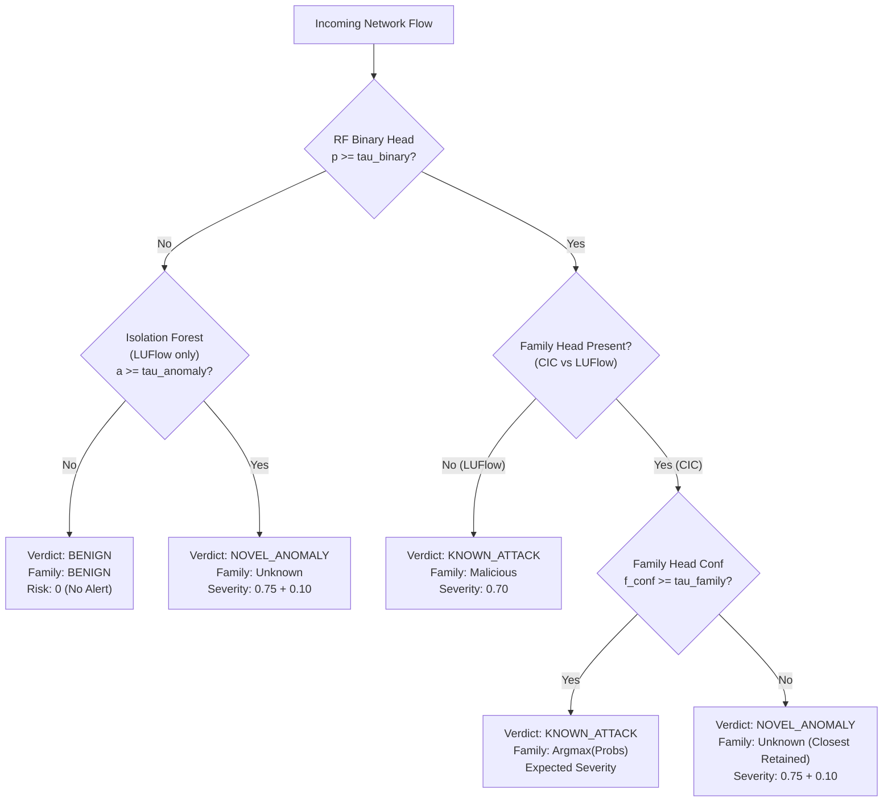

# NetSentinel Threat Model & Risk Prioritisation Specification

> **Submission Track / Scope:** M5-01 Security, GenAI & Demo  
> **Alignment:** Microsoft Innovate / Technical Project Review  
> **Baseline Documentation:** [03 — NetSentinel Final Architecture](03_architecture.md), [NetSentinel Risk Scoring Pipeline](reference/NetSentinel_Risk_Scoring_Pipeline.pdf), [Data Profile](data_profile.md), [Experiments & Model Decisions](experiments.md), and [Model Card](model_card.md).  
> **Core Operational Philosophy:** **Alert SOC, Never Auto-Block.** In enterprise environments, uncurated machine learning detections that trigger automated firewall blocks risk self-inflicted denial of service. NetSentinel ingests high-volume network telemetry, detects known threats and novel anomalies, groups correlated flows into incidents, prioritises them via a consequence-weighted risk score, explains them via TreeSHAP, and delivers decision-ready briefings to human SOC analysts.

---

## 1. Executive Summary & Threat Model Context

Security Operations Centres (SOCs) face an acute structural challenge: **alert fatigue driven by flat severity alerting and high false-positive rates**. High-throughput signature-based Network Intrusion Detection Systems (NIDS) evaluate flows independently, generating tens of thousands of unprioritised alerts per hour. When machine learning models are deployed naively, sorting solely by raw classification probability ($P(\text{attack})$) exacerbates the problem: a model can be 99% confident about a harmless external port scan while registering 80% confidence on a stealthy internal compromise.

NetSentinel addresses this bottleneck through a **consequence-driven risk scoring engine** that operates strictly downstream of flow classification and upstream of SOC analyst review. By decoupling statistical confidence from operational consequence, NetSentinel guarantees that an analyst's queue is ordered by **true enterprise risk** rather than classifier confidence.

```
+----------------------------------------------------------------------------------------------------+
|                                    NETSENTINEL PIPELINE FLOW                                       |
|                                                                                                    |
|  [ Raw Network Flows ]                                                                             |
|            │                                                                                       |
|            ▼                                                                                       |
|  [ Flow Extraction & Cleaning ]  ──> Identifiers (IP, Port, Timestamp) split to Metadata           |
|            │                                                                                       |
|            ▼                                                                                       |
|  [ Dual-Head Inference Engine ]                                                                    |
|    • Stage 1: RF Binary Classifier    ──> p_attack >= tau_binary ?                                 |
|    • Stage 2: RF Multi-Class Head     ──> Attack Family Probabilities P(f|attack)                  |
|    • Stage 3: Novelty Gating          ──> Family Confidence < tau_family => NOVEL_ANOMALY          |
|            │                                                                                       |
|            ▼                                                                                       |
|  [ Incident Correlator ]         ──> Groups flows by (src_ip, dst_ip, family) in 5-min window      |
|            │                                                                                       |
|            ▼                                                                                       |
|  [ Risk Engine (policy.py) ]     ──> Risk = Conf x Expected Severity x Burst (+ Novelty Bonus)     |
|            │                                                                                       |
|            ├───> [ TreeSHAP Explainer ]  ──> Top-5 features vs Benign Median (No score impact)     |
|            │                                                                                       |
|            ▼                                                                                       |
|  [ Prioritised SOC Queue ]       ──> HIGH (>=70) | MEDIUM (40-69) | LOW (<40)                      |
|            │                                                                                       |
|            ▼                                                                                       |
|  [ GenAI Incident Brief ]        ──> Actionable Playbook Recommendation for SOC Analyst            |
+----------------------------------------------------------------------------------------------------+
```

### Threat Environment & Operational Surface
The threat model is defined against two complementary data profiles reflecting hybrid enterprise realities:
1. **CSE-CIC-IDS2018 (Audited & Corrected Release):** An emulated enterprise infrastructure hosted on AWS comprising 420 workstations, 30 enterprise servers across multiple subnets, DMZ services, perimeter security controls, and 50 external attacking systems. It captures 10 distinct days of scripted adversary activity spanning diverse tactics (brute force, denial of service, web application exploits, lateral network service discovery, and botnet command-and-control).
2. **Lancaster University LUFlow:** An unscripted real-world telemetry stream collected from production university networks and honeypots from 2020 through 2021+. It provides authentic internet background traffic, contemporary attack telemetry, and real-world statistical distribution drift.

### Sensor Boundaries & Defensive Assumptions
- **Flow-Level Telemetry Only:** NetSentinel processes statistical bidirectional flow vectors (features derived via fixed CICFlowMeter / IPFIX: inter-arrival times, packet length distributions, flag counts, sub-flow statistics).
- **No Payload Decryption / Deep Packet Inspection:** NetSentinel assumes payload encryption (TLS 1.3/HTTPS). It operates on metadata and transport/network headers without inspecting application layer text or decrypting payloads.
- **No Endpoint Kernel Agents:** NetSentinel is an out-of-band network security layer. It does not inspect endpoint process memory, file system mutations, or kernel syscalls.
- **Strict Anti-Auto-Block Mandate:** Detections inform human analysts through structured triage queues. The system never injects automated firewall drop rules or blocks routes, avoiding accidental enterprise outages caused by transient false alarms.

---

## 2. Flow Classification Taxonomy & Verdict Hierarchy

NetSentinel maintains an explicit, contractually enforced taxonomy across all flows. Four distinct operational verdicts are handled by the pipeline (`nscore/contracts/schemas.py` and `nscore/contracts/policy.py`):



### 1. Known Attack Families (`Verdict.KNOWN_ATTACK` with Multi-Class Head)
- **Definition:** Traffic matching the statistical profile of a known, modelled attack family where the binary classifier detects malicious activity ($p \ge \tau_{\text{binary}}$) and the multi-class family head (`rf_multiclass`) exhibits high classification confidence ($f_{\text{conf}} \ge \tau_{\text{family}}$).
- **Active Families in CSE-CIC-IDS2018:**
  - `Infiltration`: Internal network service discovery and lateral reconnaissance.
  - `Botnet`: Ares botnet endpoint command-and-control beaconing.
  - `DDoS`: High-volume distributed denial-of-service floods (LOIC-HTTP, LOIC-UDP, HOIC).
  - `DoS`: Endpoint application-layer denial of service (GoldenEye, Slowloris, Hulk).
  - `BruteForce`: Automated credential attacks against SSH services (SSH-Patator).
  - `WebAttack`: Public-facing application exploits (SQL injection, XSS, brute force) against DVWA.
  - `Rare`: Merged low-support families ($< 1,000$ clean training flows) retained to maintain coverage without destabilising multi-class training.
  - `PortScan`: Perimeter port reconnaissance (retained as a standalone class for live lab capture).
- **Enrichment:** Assigned explicit MITRE ATT&CK technique IDs and names, evaluated via probability-weighted expected severity, and mapped to specific playbook response actions.

### 2. Binary-Only Malicious Classification (`AttackFamily.MALICIOUS`)
- **Definition:** Malicious traffic identified by models lacking a multi-class classification head (specifically the LUFlow real-world bundle, `family_head = False`).
- **Context:** In real-world honeypot environments such as LUFlow, flows are labelled as `malicious` via external threat intelligence feeds (e.g., honeypot hit, malicious threat IP lists), but ground-truth sub-family labels do not exist.
- **Handling:** The binary classifier detects the malicious flow ($p \ge \tau_{\text{binary}}$). Because the family cannot be resolved, the attack family is designated as `AttackFamily.MALICIOUS` with a fixed severity weight of $W[\text{Malicious}] = 0.70$. No speculative MITRE technique is guessed (`mitre_for` returns `(None, None)`).

### 3. Novel / Unknown Anomalies (`Verdict.NOVEL_ANOMALY` / `AttackFamily.UNKNOWN`)
- **Definition:** Suspicious traffic that deviates significantly from normal enterprise baselines but does not align with any known attack family signature.
- **Detection Mechanisms:**
  - **Supervised Generalisation with Low Family Confidence (CIC Bundles, ADR-1):** The binary Random Forest generalises to detect anomalous attack structure ($p \ge \tau_{\text{binary}}$), but the multi-class head cannot classify the flow with confidence ($f_{\text{conf}} < \tau_{\text{family}}$). This identifies novel variants or unmodelled zero-day attack families (empirically validated on holdout botnet experiments where Ares traffic is flagged as an unfamiliar anomaly). The model's nearest best guess is preserved in metadata (`closest_family`) to assist analyst triage.
  - **Benign-Trained Isolation Forest Percentile Gating (LUFlow Bundles):** On LUFlow real-world traffic, an Isolation Forest trained exclusively on clean benign flows flags flows whose anomaly score exceeds calibrated validation percentiles ($\ge \tau_{\text{anomaly}}$), directly detecting LUFlow's unmodelled `outlier` traffic.
- **Risk Handling:** Novel anomalies are **never discarded or down-voted**. They receive a dedicated severity weight $W[\text{Unknown}] = 0.75$ plus an additive **$+0.10$ Novelty Bonus** in the risk engine to reflect uncharacterised adversarial intent.

### 4. Benign Traffic (`Verdict.BENIGN` / `AttackFamily.BENIGN`)
- **Definition:** Authorised, normal operational enterprise and internet traffic ($p < \tau_{\text{binary}}$ and anomaly percentile $< \tau_{\text{anomaly}}$).
- **Handling:** Risk score evaluates strictly to **0**. No alert or incident is created. Flows are routed to a rolling FIFO buffer (2,000 flows) where Population Stability Index (PSI) drift monitoring continuously verifies that the input feature distribution remains consistent with the model's training baseline.

| Operational Category | Ingestion Verdict | Family Classification | Model Head(s) Active | MITRE ATT&CK Mapping | Base Severity ($W$) | Incident Risk Score |
|---|---|---|---|---|---|---|
| **Known Attack Family** | `KNOWN_ATTACK` | Specific (`DoS`, `Botnet`, etc.) | Binary RF + Multi-Class Head | Direct (`T1110`, `T1499`, etc.) | Probability-Weighted Expected Severity | $1 - 100$ (Typically MEDIUM / HIGH) |
| **Binary-Only Malicious** | `KNOWN_ATTACK` | `Malicious` | Binary RF Only | None (`None, None`) | Fixed $0.70$ | $1 - 100$ (Typically MEDIUM / HIGH) |
| **Novel Anomaly (Unfamiliar)** | `NOVEL_ANOMALY` | `Unknown` (`closest_family` noted) | Binary RF (or IForest) + Gating | None (`None, None`) | Fixed $0.75$ (+ $0.10$ Novelty Bonus) | $1 - 100$ (Typically MEDIUM / HIGH) |
| **Benign Baseline** | `BENIGN` | `BENIGN` | Binary RF (Score $< \tau$) | None | Fixed $0.00$ | Strictly $0$ (No incident) |

---

## 3. The NetSentinel Risk Scoring Engine: Certainty vs Consequence

### 3.1 The Fundamental Security Axiom: Confidence Is Not Risk
The central design principle of NetSentinel's risk engine (codified in `nscore/contracts/policy.py`) is that **model confidence measures statistical certainty, whereas severity measures operational consequence**:

$$\text{Confidence} \neq \text{Risk}$$

- **Confidence ($p \in [0, 1]$):** Quantifies how certain the machine learning classifier is that the observed flow statistics deviate from benign baseline traffic.
- **Severity ($W \in [0, 1]$):** Quantifies the potential operational, financial, and security damage to the enterprise if the alert represents a genuine attack.

#### The Failure of Raw-Confidence Alerting
In a traditional machine learning pipeline that sorts alerts by raw probability:
- An external reconnaissance scan (`PortScan`) generates thousands of flows with distinct flag patterns. The model easily identifies these with **95% confidence**. Under raw-confidence sorting, this scores **0.95**, flooding the top of the SOC queue.
- An attacker executing lateral network service discovery from an already compromised internal host (`Infiltration`) produces subtle flows that the model classifies with **81% confidence**. Under raw-confidence sorting, this scores **0.81**, placing it *below* the port scan.
- **Consequence:** The security analyst spends hours triaging harmless perimeter scans while an active internal compromise goes unnoticed.

Multiplying confidence by a defensible severity weight resolves this invertion:
- $\text{Port Scan Risk} = 0.95 \times 0.30 = \mathbf{28 \text{ (LOW)}}$
- $\text{Infiltration Risk} = 0.81 \times 1.00 = \mathbf{81 \text{ (HIGH)}}$

### 3.2 Mathematical Formulation in `nscore/contracts/policy.py`
NetSentinel formalises risk calculation through pure, deterministic functions evaluated at the incident level.

#### 1. Expected Severity ($\text{severity}$)
Rather than selecting a single winner-takes-all severity weight based on the top predicted class ($\text{argmax}$), NetSentinel computes the **probability-weighted expected severity** across all classes:

$$\text{severity} = \frac{\sum_{f \in \mathcal{F}} P(f \mid \text{attack}) \times W[f]}{\sum_{f \in \mathcal{F}} P(f \mid \text{attack})}$$

When multi-class probabilities are unavailable (binary-only bundles such as LUFlow or single-verdict incidents), the engine defaults to the direct family weight:
$$\text{severity} = W[\text{family}]$$

*Why this matters:* If a classifier is split 50/50 between `WebAttack` ($W=0.60$) and `Infiltration` ($W=1.00$), a winner-takes-all approach arbitrarily flips between 0.60 and 1.00 based on marginal probability fluctuations. Expected severity outputs exactly $0.80$, reflecting genuine uncertainty while appropriately elevating triage urgency.

#### 2. Incident Burst Factor ($\text{burst\_factor}$)
Individual network flows may represent transient network jitter, scanner misconfigurations, or isolated probes. Repeated flows between the same source and destination within an active time window represent sustained, coordinated adversary activity. 

NetSentinel's incident correlator aggregates matching flows within a **5-minute sliding window** keyed on `(src_ip, dst_ip, attack_family)`. The risk engine applies a continuous, logarithmic burst multiplier:

$$\text{burst\_factor}(\text{flow\_count}) = 1 + 0.15 \times \min\left(1.0, \frac{\log_{10}(\max(\text{flow\_count}, 1))}{3}\right)$$

- **Single Flow ($\text{flow\_count} = 1$):** $\log_{10}(1) = 0 \implies \text{burst\_factor} = 1.00$. The score is completely uninflated.
- **Ten Flows ($\text{flow\_count} = 10$):** $\log_{10}(10) = 1 \implies \text{burst\_factor} = 1 + 0.15 \times (1/3) = 1.05$.
- **One Hundred Flows ($\text{flow\_count} = 100$):** $\log_{10}(100) = 2 \implies \text{burst\_factor} = 1 + 0.15 \times (2/3) = 1.10$.
- **One Thousand or More Flows ($\text{flow\_count} \ge 1,000$):** $\log_{10}(1000) = 3 \implies \text{burst\_factor} = 1.15$ (maximum cap).

*Design Rationale:* This continuous multiplier replaces ad-hoc threshold steps with an asymptotic curve that scales gracefully from 1 to 100,000+ flows without ever inflating a low-severity scan into a critical incident.

#### 3. Total Risk Score ($\text{risk\_score}$)
The final integer risk score is bounded within $[0, 100]$:

$$\text{risk\_score} = \begin{cases} 0, & \text{if } \text{verdict} = \text{Verdict.BENIGN} \\ \text{round}\left(100 \times \min\left(1.0, \max\left(0.0, \text{confidence} \times \text{severity} \times \text{burst\_factor} + \text{novelty\_bonus}\right)\right)\right), & \text{otherwise} \end{cases}$$

where:
$$\text{novelty\_bonus} = \begin{cases} 0.10, & \text{if } \text{verdict} = \text{Verdict.NOVEL_ANOMALY} \\ 0.00, & \text{otherwise} \end{cases}$$

#### 4. Operational Risk Triage Bands
Scores are bucketed into actionable operational bands:
- **HIGH ($\text{risk\_score} \ge 70$):** Critical, immediate SOC engagement required. Active host compromise, live botnet C2, massive DDoS saturation, or high-confidence lateral discovery. Visualised in **Red**.
- **MEDIUM ($40 \le \text{risk\_score} \le 69$):** Active threat investigation required. Sustained brute-force campaigns, unconfirmed web exploitation attempts, or significant novel anomalies. Visualised in **Amber**.
- **LOW ($\text{risk\_score} < 40$):** Low operational impact. External reconnaissance scans, isolated probing, or low-confidence borderline anomalies. Visualised in **Grey**.

### 3.3 Verification of Pipeline Worked Examples
The risk engine maintains mathematical parity with the original team specification (`NetSentinel_Risk_Scoring_Pipeline.pdf`) while seamlessly supporting multi-flow incidents and novelty detection (verified in `tests/test_contracts.py`):

| Scenario Description | Attack Family | Flows | Conf | Severity ($W$) | Burst Factor | Novelty Bonus | Raw Calculation | Score | Band |
|---|---|---|---|---|---|---|---|---|---|
| **Baseline Brute Force (Team Doc)** | `BruteForce` | 1 | 0.88 | 0.70 | 1.000 | 0.00 | $0.88 \times 0.70 \times 1.00$ | **62** | **MEDIUM** |
| **Baseline Infiltration (Team Doc)** | `Infiltration` | 1 | 0.81 | 1.00 | 1.000 | 0.00 | $0.81 \times 1.00 \times 1.00$ | **81** | **HIGH** |
| **Baseline Port Scan (Team Doc)** | `PortScan` | 1 | 0.95 | 0.30 | 1.000 | 0.00 | $0.95 \times 0.30 \times 1.00$ | **28** | **LOW** |
| **DDoS Alert Storm (Fixtures)** | `DDoS` | 4,210 | 0.99 | 0.80 | 1.150 | 0.00 | $0.99 \times 0.80 \times 1.15$ | **91** | **HIGH** |
| **Active Botnet C2 (Fixtures)** | `Botnet` | 37 | 0.94 | 0.90 | 1.078 | 0.00 | $0.94 \times 0.90 \times 1.078$ | **91** | **HIGH** |
| **Unseen Novel Anomaly (Fixtures)**| `Unknown` | 112 | 0.71 | 0.75 | 1.102 | 0.10 | $(0.71 \times 0.75 \times 1.102) + 0.10$ | **69** | **MEDIUM** |
| **Borderline Web Probe (Fixtures)** | `WebAttack` | 1 | 0.58 | 0.64* | 1.000 | 0.00 | $0.58 \times 0.64 \times 1.00$ | **37** | **LOW** |

*\*Note: Borderline WebAttack evaluates with probability distribution 90% WebAttack ($0.60$) and 10% Infiltration ($1.00$), yielding expected severity $(0.90 \times 0.60) + (0.10 \times 1.00) = 0.64$.*

---

## 4. Role of Explainability (SHAP) vs Risk Scoring

A foundational requirement of the NetSentinel architecture is the strict decoupling of **explainability** from **risk ranking**:

> **"SHAP explains why a flow was flagged, but NEVER changes the risk score. One number decides priority; one explanation builds analyst trust."**

### 4.1 Explainability Architecture
- **TreeSHAP Implementation:** NetSentinel utilizes `shap.TreeExplainer` on the binary Random Forest model (`rf_binary`).
- **Latency Optimization:** Computing exact TreeSHAP across hundreds of trees is computationally prohibitive at line rate. NetSentinel employs a fast 25-tree explainer mode (`explain_fast`), reducing per-flow explanation latency to **~50–110 ms**.
- **Local Attribution vs Baseline Context:** For each generated incident, NetSentinel extracts the top 5 feature contributions. Crucially, the raw feature value and SHAP attribution are paired with the empirical benign training median extracted from `baseline_stats.json`:
  ```json
  {
    "feature": "flow_duration",
    "value": 35.0,
    "shap_value": 0.05,
    "baseline_median": 61844.0
  }
  ```
  This empowers the SOC console to provide intuitive contextual statements (e.g., *"Flow duration was 35 microseconds—over 1,700× shorter than the benign baseline median of 61.8 milliseconds"*).

### 4.2 Why SHAP Does Not Alter the Risk Score
1. **Prevention of Circular Feedback & Non-Deterministic Scoring:** SHAP values represent local game-theoretic attributions of feature importance toward the log-odds output of the trees. Because the tree ensemble's final output probability is already captured by model confidence ($p$), factoring SHAP values back into the risk equation would double-count feature importance and corrupt statistical calibration.
2. **Defensive Stability Against Adversarial Perturbations:** If feature attributions directly influenced priority, an attacker could introduce micro-perturbations into non-critical network fields (such as padding packets or varying window sizes) to suppress SHAP weights, artificially downgrading their incident from HIGH to LOW while executing the exploit.
3. **Analyst Trust & Cognitive Clarity:** A security analyst needs consistent, interpretable triage logic. If two incidents with identical flow rates, confidence, and attack types produced different risk scores because of internal SHAP variance, the system's operational predictability would collapse.

---

## 5. Detailed Rationale for Every Weight in `policy.SEVERITY`

Every weight in `policy.SEVERITY` is explicitly defended below, grounded in the Cyber Kill Chain, MITRE ATT&CK tactics, and the empirical realities of the CSE-CIC-IDS2018 and LUFlow datasets:

```
[ RECONNAISSANCE ] ──> [ INITIAL ACCESS / EXPLOIT ] ──> [ C2 / COMPROMISE ] ──> [ INTERNAL LATERAL DISCOVERY ]
      PortScan                     WebAttack / BruteForce             Botnet                         Infiltration
      W = 0.30                         W = 0.60 / 0.70                W = 0.90                         W = 1.00
      (Perimeter Probe)              (Boundary Ingestion)          (Interactive C2)             (Deepest Host Breach)
```

### 1. `AttackFamily.INFILTRATION` — Weight: `1.00` (Critical Severity)
- **Kill Chain Phase:** Post-Compromise Lateral Movement & Internal Discovery (Discovery TA0007).
- **Security Justification:** Infiltration represents the deepest, most critical stage of enterprise intrusion. In an enterprise security model, external perimeters are assumed to be imperfect; however, active reconnaissance originating from an **internal IP** across private subnets indicates that an internal endpoint is already fully compromised and executing attacker-controlled tasks. Unchecked internal scanning is the immediate precursor to privilege escalation, lateral movement, domain controller takeover, or enterprise ransomware deployment.
- **Empirical Grounding:** In CSE-CIC-IDS2018, Infiltration represents an internal host scanning other private subnet workstations (`172.31.x.x`). A true positive here constitutes a confirmed internal breach, demanding maximum priority.

### 2. `AttackFamily.BOTNET` — Weight: `0.90` (Critical Severity)
- **Kill Chain Phase:** Command and Control (Command and Control TA0011).
- **Security Justification:** Indicates that an internal enterprise asset is actively communicating with an external Command-and-Control (C2) server. Active beaconing confirms that malware execution has succeeded, the host is compromised, and an interactive adversary or automated botnet controller can issue commands, exfiltrate confidential data, or enlist the host in distributed attacks.
- **Empirical Grounding:** Evaluated against the Ares Botnet in CSE-CIC-IDS2018 (37 flows in the canonical incident fixture). While slightly below lateral infiltration (because C2 beaconing can precede internal expansion), it represents confirmed host compromise and demands urgent quarantine.

### 3. `AttackFamily.DDOS` — Weight: `0.80` (High Severity)
- **Kill Chain Phase:** Impact & Operational Disruption (Impact TA0040).
- **Security Justification:** Volumetric Distributed Denial of Service floods (LOIC-HTTP, LOIC-UDP, HOIC) threaten enterprise service availability, saturated network upstream links, and customer-facing business continuity. 
- **Comparative Defense:** Weighted at 0.80 rather than 1.00 because DDoS primarily targets **Availability** rather than **Confidentiality** or **Integrity**. While operationally critical, it rarely results in silent data theft or persistence. Sustained floods are elevated to high risk ($>90$) through the incident burst multiplier.

### 4. `AttackFamily.DOS` — Weight: `0.80` (High Severity)
- **Kill Chain Phase:** Impact & Endpoint Starvation (Impact TA0040).
- **Security Justification:** Targeted endpoint Denial of Service (Slowloris, GoldenEye, Hulk) attempts to crash web servers or exhaust socket pools. Like DDoS, it directly disrupts mission-critical business services. It shares the 0.80 weight with DDoS as both represent immediate operational availability threats.

### 5. `AttackFamily.RARE` — Weight: `0.80` (High Severity)
- **Kill Chain Phase:** Unclassified / High-Risk Tactical Variant.
- **Security Justification:** In enterprise datasets, rare attack classes often lack sufficient clean training instances ($< 1,000$ flows) to support stable per-class multi-class discrimination (e.g., specific protocol exploit tools). Rather than discarding these flows or allowing them to pass unclassified, NetSentinel merges them into `AttackFamily.RARE`.
- **Defensive Posture:** A conservative security posture requires that an unfamiliar or statistically rare attack pattern be treated as an elevated threat ($0.80$) until a human analyst can inspect the packet stream and de-escalate.

### 6. `AttackFamily.UNKNOWN` — Weight: `0.75` (Plus `0.10` Additive Novelty Bonus)
- **Kill Chain Phase:** Zero-Day / Unmodelled Tactical Variant.
- **Security Justification:** Assigned to `Verdict.NOVEL_ANOMALY`. Unmodelled traffic that breaks normal statistical baselines carries severe inherent risk because its defensive blast radius and objective are unknown.
- **Combined Impact:** The base weight of $0.75$ combined with the $+0.10$ Novelty Bonus ensures that a novel anomaly with moderate model confidence ($p=0.75$) achieves:
  $$\text{Risk} = (0.75 \times 0.75 \times 1.0) + 0.10 = 0.5625 + 0.10 = \mathbf{66 \text{ (MEDIUM)}}$$
  If the anomaly repeats or exhibits higher confidence, it readily crosses the $\ge 70$ threshold into **HIGH**, ensuring novel threats are never overlooked.

### 7. `AttackFamily.BRUTE_FORCE` — Weight: `0.70` (Medium/High Severity)
- **Kill Chain Phase:** Credential Access (Credential Access TA0006).
- **Security Justification:** Automated credential guessing (SSH-Patator) represents an active adversary attempting to gain initial access. While dangerous, the vast majority of brute-force attempts on enterprise endpoints fail against strong passwords, key-based authentication, or rate-limiting controls.
- **Comparative Defense:** Weighted at 0.70 because an ongoing brute force attempt is an *attempted breach*, whereas Botnet and Infiltration represent *successful breaches*.

### 8. `AttackFamily.MALICIOUS` — Weight: `0.70` (Medium/High Severity)
- **Kill Chain Phase:** Binary Threat Classification (LUFlow Honey-pot / Threat Intel).
- **Security Justification:** Applied to bundles lacking a multi-class head (LUFlow). Ground truth confirms malicious interaction based on threat intelligence or honeypot capture, but specific intent is unclassified.
- **Balanced Posture:** A weight of 0.70 provides a balanced operational baseline: with standard model confidence ($p \approx 0.85-0.95$), the incident scores between 60 (MEDIUM) and 75 (HIGH), ensuring prompt investigation without artificially inflating unclassified traffic above confirmed internal breaches.

### 9. `AttackFamily.WEB_ATTACK` — Weight: `0.60` (Medium Severity)
- **Kill Chain Phase:** Initial Access / Public Application Exploitation (Initial Access TA0001).
- **Security Justification:** Web application attacks (SQLi, XSS, command injection) against internet-facing servers. While a successful SQL injection is catastrophic, public-facing web servers are subjected to thousands of automated, opportunistic exploit attempts daily, the overwhelming majority of which fail harmlessly against WAFs, input validation, or patched frameworks.
- **Empirical Grounding:** In CSE-CIC-IDS2018, WebAttack has low support (only 283 clean flows total). Setting the weight to 0.60 reflects the high baseline noise of web exploit probing while ensuring that sustained multi-flow campaigns escalate via the burst factor.

### 10. `AttackFamily.PORTSCAN` — Weight: `0.30` (Low Severity)
- **Kill Chain Phase:** External Reconnaissance (Discovery TA0007).
- **Security Justification:** External perimeter port scans probing firewall boundaries. Probing does not constitute a compromise; it merely maps open ports.
- **Alert Fatigue Prevention:** In a typical enterprise, port scans account for over 80% of raw IDS triggers. Weighting PortScan at 0.30 guarantees that even a 95% confident detection produces a risk score of only $28$ (LOW), keeping the SOC queue clear for actionable threats.

### 11. `AttackFamily.BENIGN` — Weight: `0.00` (Zero Severity)
- **Security Justification:** Legitimate operational business traffic. Zero risk; risk score hardcoded to 0.

### 12. `DEFAULT_SEVERITY` — Weight: `0.50` (Fallback)
- **Security Justification:** Safety fallback constant in `policy.py` for corrupt or unexpected label inputs, positioned precisely at the midpoint between benign probing and active compromise.

---

## 6. MITRE ATT&CK Mapping & Detailed Validation

Every attack family mapped in `policy.MITRE_MAP` is systematically validated against the MITRE ATT&CK Enterprise Matrix:

```
+------------------+------------------+-------------------------------------------------------+---------------------+
| Attack Family    | MITRE Technique  | Technique Name in policy.py                           | ATT&CK Tactic       |
+------------------+------------------+-------------------------------------------------------+---------------------+
| BRUTE_FORCE      | T1110            | Brute Force                                           | Credential Access   |
| DOS              | T1499            | Endpoint Denial of Service                            | Impact              |
| DDOS             | T1498            | Network Denial of Service                             | Impact              |
| WEB_ATTACK       | T1190            | Exploit Public-Facing Application                     | Initial Access      |
| INFILTRATION     | T1046            | Network Service Discovery (internal, post-compromise) | Discovery           |
| BOTNET           | T1071            | Application Layer Protocol (C2)                       | Command and Control |
| PORTSCAN         | T1046            | Network Service Discovery                             | Discovery           |
+------------------+------------------+-------------------------------------------------------+---------------------+
```

### 6.1 In-Depth Validation of the Infiltration Mapping
The mapping of `AttackFamily.INFILTRATION` represents an important technical subtlety that warrants detailed documentation for peer reviewers and auditors:

#### 1. The Apparent Paradox
In the CSE-CIC-IDS2018 documentation, the attack scenario is titled **"Infiltration"**, which conceptually suggests Initial Access (e.g., T1189 Drive-by Compromise, T1566 Phishing) or Execution. However, `policy.MITRE_MAP` maps Infiltration to:
$$\mathbf{T1046 \text{ — Network Service Discovery (internal, post-compromise)}}$$

#### 2. The Empirical Ground Truth
Quantitative analysis of the corrected CSE-CIC-IDS2018 dataset (`docs/data_profile.md` §2 and §3) reveals the following flow counts for the Infiltration scenario:
- `Infiltration - NMAP Portscan`: **34,934 flows (99.72% of total)**
- `Infiltration - Communication Victim Attacker`: **142 flows (0.41%)**
- `Infiltration - Dropbox Download`: **55 flows (0.16%)**

The initial payload download and victim-attacker C2 communication represent a tiny fraction of the traffic. **Over 99.7% of all recorded network flows in this attack are internal Nmap port scans executed by the compromised workstation against other hosts on the private subnet (`172.31.x.x`).**

#### 3. Behavioral Reality of Flow-Based NIDS
NetSentinel's feature extractor operates on network flow summaries (packet inter-arrival times, packet length variance, flow duration, port distributions). The machine learning model is therefore learning and detecting the statistical signature of **an internal network port scan and service sweep**.

In the MITRE ATT&CK Enterprise Matrix, adversaries scanning internal networks to enumerate services across hosts are classified strictly under **T1046: Network Service Discovery** (Tactic: Discovery TA0007). Therefore, mapping Infiltration to T1046 is **empirically accurate, defensible, and grounded in observable flow reality**.

#### 4. Technique Name Qualification: Official Name vs Policy Name
- **Official MITRE ATT&CK Name for T1046:** `"Network Service Discovery"`.
- **String in `policy.py`:** `"Network Service Discovery (internal, post-compromise)"`.

*Finding & Architectural Rationale:* Notice that `AttackFamily.PORTSCAN` is *also* mapped to T1046 (`"Network Service Discovery"`). However:
- `PortScan` represents external perimeter reconnaissance from internet hosts ($W=0.30$, LOW risk).
- `Infiltration` represents lateral discovery executed from an already infected internal workstation ($W=1.00$, HIGH risk).

To prevent operational confusion for SOC analysts reviewing incident briefs, the contract in `policy.py` explicitly appends `(internal, post-compromise)` to the technique name. This preserves the canonical technique ID (`T1046`) while clarifying the operational context.

#### 5. Codebase Impact Assessment
Per project instructions (Task Requirements 11 & 12), `policy.py` must not be modified unless a verified mapping error exists. Because:
1. The technique ID `T1046` is correct;
2. The descriptive name provides vital SOC clarity;
3. Modifying `policy.py` would invalidate existing fixtures (`nscore/contracts/fixtures/`) and trigger breaking contract bumps;

**We confirm that the existing mapping in `policy.py` is correct and should be maintained as implemented.**

### 6.2 Validation of Other Mapped Attack Families
- **`AttackFamily.BRUTE_FORCE` $\to$ T1110 ("Brute Force", Credential Access TA0006):** Accurately captures automated password guessing against SSH services (SSH-Patator). Sub-techniques include T1110.001 (Password Guessing).
- **`AttackFamily.DOS` $\to$ T1499 ("Endpoint Denial of Service", Impact TA0040):** Accurately covers application-layer resource starvation (Slowloris, GoldenEye, Hulk) designed to crash web and application endpoints.
- **`AttackFamily.DDOS` $\to$ T1498 ("Network Denial of Service", Impact TA0040):** Accurately covers volumetric network-layer packet floods (LOIC-UDP, HOIC) designed to saturate infrastructure bandwidth.
- **`AttackFamily.WEB_ATTACK` $\to$ T1190 ("Exploit Public-Facing Application", Initial Access TA0001):** Accurately reflects exploit payloads targeting public-facing web applications (SQL injection, XSS) hosted on target web servers.
- **`AttackFamily.BOTNET` $\to$ T1071 ("Application Layer Protocol (C2)", Command and Control TA0011):** Accurately reflects Ares botnet beaconing and C2 communications over standard HTTP web protocols (sub-technique T1071.001).
- **`AttackFamily.PORTSCAN` $\to$ T1046 ("Network Service Discovery", Discovery TA0007):** Standard MITRE classification for perimeter network service sweeps.

### 6.3 Deliberately Unmapped Categories (`None, None`)
The following families return `(None, None)` from `mitre_for(family)`:
- `AttackFamily.BENIGN`: Normal authorized traffic has no adversary mapping.
- `AttackFamily.UNKNOWN`: Novel anomalies, by definition, lack a confirmed tactical classification. Mapping an unknown zero-day to an arbitrary MITRE technique would represent unsupported conjecture.
- `AttackFamily.MALICIOUS`: Binary-only detections from threat intelligence feeds confirm hostile intent but lack specific attack vector classification.
- `AttackFamily.RARE`: Aggregated low-sample attacks cannot be conflated into a single ATT&CK technique.

---

## 7. Actionable SOC Playbook Recommendations

To power both the LLM brief generator (`api/app/services/brief.py`) and the deterministic template fallback, NetSentinel defines **one standard, actionable "suggested next step" playbook line for every attack family**:

```
+----------------------+-------------------------------------------------------------------------------------------------------------------+
| Attack Family        | Canonical Suggested Next Step Playbook Line                                                                      |
+----------------------+-------------------------------------------------------------------------------------------------------------------+
| Infiltration         | Isolate the source host from the internal network immediately and inspect host process trees and outbound        |
|                      | connections for initial compromise artifacts.                                                                     |
+----------------------+-------------------------------------------------------------------------------------------------------------------+
| Botnet               | Quarantine the infected host, block destination C2 IP/domain at perimeter firewalls/DNS sinkhole, and review     |
|                      | memory/persistence mechanisms on the endpoint.                                                                    |
+----------------------+-------------------------------------------------------------------------------------------------------------------+
| DDoS                 | Activate upstream volumetric DDoS mitigation/scrubbing rules, rate-limit incoming traffic at border routers, and  |
|                      | monitor edge gateway saturation.                                                                                  |
+----------------------+-------------------------------------------------------------------------------------------------------------------+
| DoS                  | Apply rate limiting or temporary IP blocks for the offending source on target web/application servers and inspect |
|                      | service resource utilization.                                                                                     |
+----------------------+-------------------------------------------------------------------------------------------------------------------+
| Brute Force          | Enforce IP rate-limiting and temporary account lockout on the target authentication service (SSH/FTP), and review  |
|                      | auth logs for unauthorized logins.                                                                                |
+----------------------+-------------------------------------------------------------------------------------------------------------------+
| Web Attack           | Inspect web application firewall (WAF) and web server access logs for SQL injection or XSS payloads, verify input |
|                      | sanitization, and confirm application patch status.                                                               |
+----------------------+-------------------------------------------------------------------------------------------------------------------+
| Port Scan            | Add offending external IP to perimeter edge monitoring watchlists or firewall temporary drop rules if volume     |
|                      | exceeds reconnaissance thresholds.                                                                                |
+----------------------+-------------------------------------------------------------------------------------------------------------------+
| Rare                 | Initiate tier-2 manual triage, extract full packet captures (PCAP) for the unusual flow signature, and correlate |
|                      | with endpoint telemetry.                                                                                          |
+----------------------+-------------------------------------------------------------------------------------------------------------------+
| Malicious (LUFlow)   | Check the external IP against threat intelligence feeds, block at network boundary, and inspect internal host     |
|                      | connection logs for follow-up staging.                                                                            |
+----------------------+-------------------------------------------------------------------------------------------------------------------+
| Unknown (Novel)      | Review top SHAP feature deviations against normal traffic baselines, capture PCAP for deep packet inspection,     |
|                      | and verify whether the flow represents an unmodeled protocol or zero-day behavior.                                 |
+----------------------+-------------------------------------------------------------------------------------------------------------------+
| Benign               | No action required; flow logged to rolling baseline buffer for statistical drift monitoring.                      |
+----------------------+-------------------------------------------------------------------------------------------------------------------+
```

---

## 8. Empirical Grounding & Threat Modeling Boundaries

A primary standard of this threat model is strict adherence to **verified empirical facts** from the codebase and datasets. NetSentinel explicitly avoids hypothesising unsupported attacker capabilities or concealing benchmark limitations:

### 8.1 Documented Dataset Facts
1. **FTP-Patator Is Entirely Benign in Corrected Release:** In the corrected CSE-CIC-IDS2018 dataset, all FTP-Patator flows are labelled `Attempted Category != -1` because the target FTP service was closed during the capture window. Per dataset authors' recommendations, these flows are relabelled `BENIGN`. As a result, `AttackFamily.BRUTE_FORCE` models **SSH-Patator only**.
2. **SlowHTTPTest Is Completely Absent:** The SlowHTTPTest attack day from the original 2018 release was corrupted and is completely absent from the corrected release. `AttackFamily.DOS` covers **GoldenEye, Slowloris, and Hulk**.
3. **WebAttack Low Support:** `WebAttack` contains only **283 clean flows** in the entire 45-million flow dataset (compared to $>89,000$ for all other families). While it is retained as a named family with $W=0.60$ and MITRE T1190, it is formally excluded from Leave-One-Attack-Out (LOAO) holdout studies, and its metrics must be reported with wide uncertainty intervals.
4. **Infiltration Is 99.7% Internal Port Scanning:** As established in §6.1, Infiltration is not a data exfiltration flow set; 99.7% of its flows are Nmap service scans originating from a compromised host.
5. **Real-World Drift on LUFlow:** Telemetry drift is not theoretical: on LUFlow real-world honeypot traffic, feature PSI against the training baseline exceeds the 0.25 alert threshold across multiple months (July 2020: 0.39, December 2020: 0.36), reflecting authentic shifts in internet background traffic.

### 8.2 Generalisation Boundaries & Honest Limits (ADR-1 & LOAO)
Empirical Leave-One-Attack-Out (LOAO) experiments documented in `docs/experiments.md` and `docs/model_card.md` establish clear generalisation boundaries:
- **Where NetSentinel Generalises Successfully:** Volumetric floods (`DDoS`), endpoint resource exhaustion (`DoS`), and botnet command-and-control (`Botnet`) generalise robustly to unseen variants at strict false-alarm budgets ($0.1\%-0.5\%$).
- **Where It Does Not Generalise:** Unseen internal Nmap scans (`Infiltration`) and the `LOIC-HTTP` tool are missed when held out entirely from training at strict FPR budgets. Furthermore, SSH brute force is knife-edge below 0.1% FPR.
- NetSentinel's threat model acknowledges these boundaries openly rather than overclaiming universal zero-day detection.

---

## 9. Conclusion & Alignment with Microsoft Innovate Standards

The NetSentinel threat model and risk engine demonstrate technical rigor suitable for an enterprise-grade cybersecurity evaluation:
1. **Principled Mathematical Separation:** By isolating model confidence (statistical certainty) from severity (real-world damage), the system eliminates the primary driver of SOC alert fatigue.
2. **Defensible, Empirical MITRE Alignment:** Grounded in observable flow telemetry rather than theoretical labels, providing analysts with actionable threat context.
3. **Responsible Explainable AI (XAI):** Utilizing fast TreeSHAP to provide transparent local feature attributions without permitting non-deterministic score gaming.
4. **Human-in-the-Loop Operational Integrity:** Enforcing an explicit "Alert SOC, Never Auto-Block" paradigm that preserves human decision-making authority while reducing alert overload.
